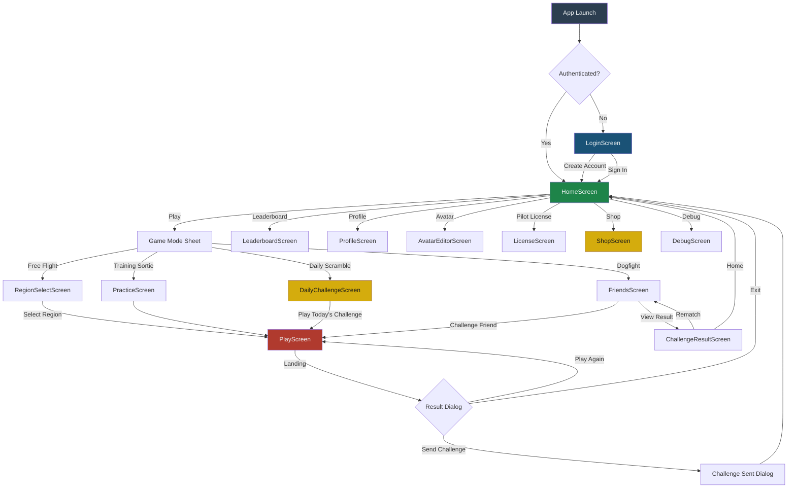
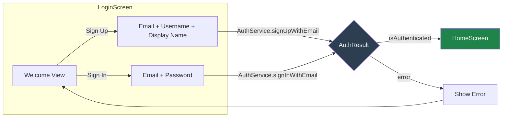
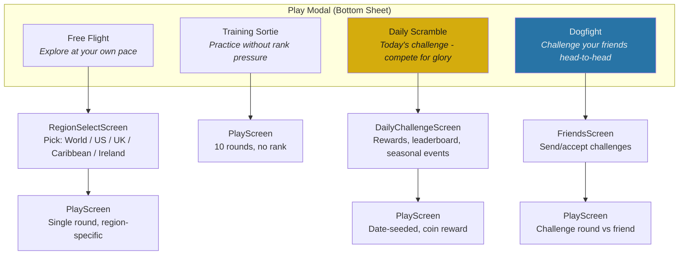
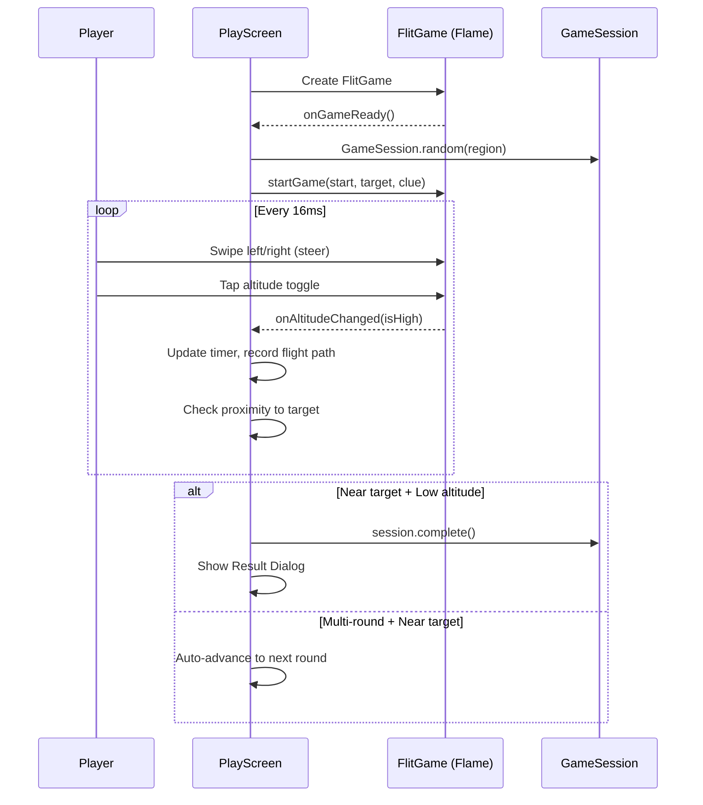
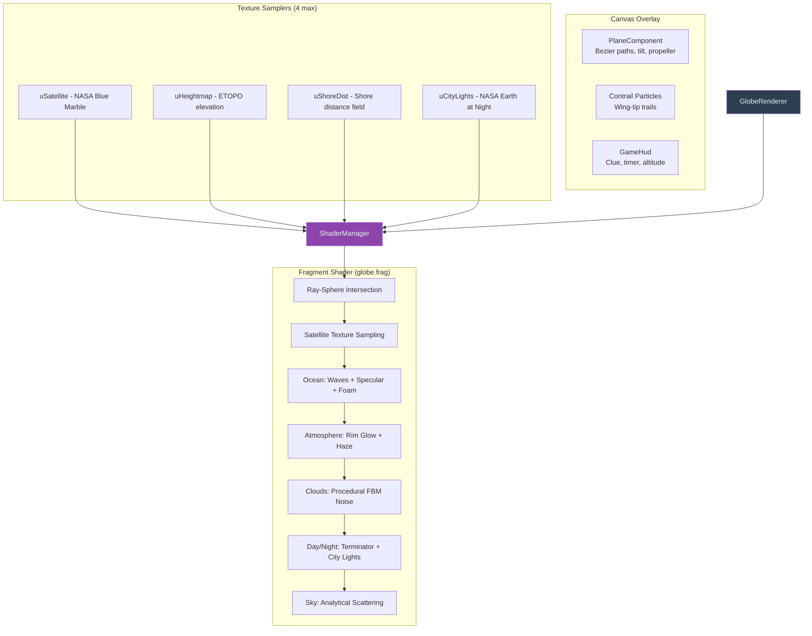
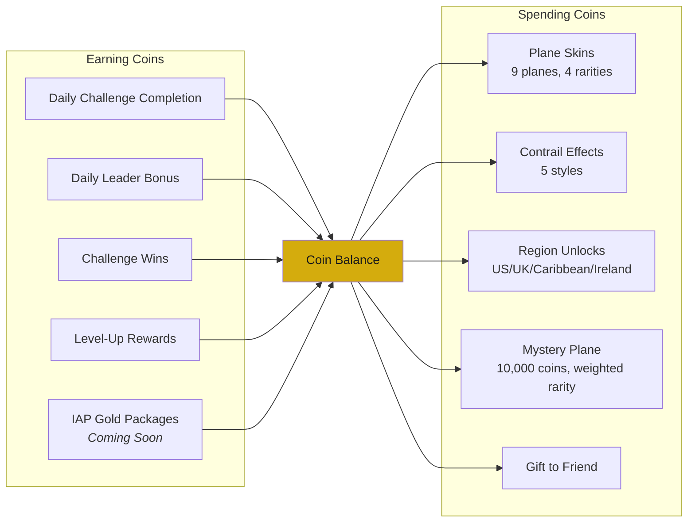

# Flit - Application Architecture

## Screen Flow

The app follows a linear navigation model. The entry point is `LoginScreen`,
which transitions to `HomeScreen` after authentication. From there, all features
are accessible via the main menu.



---

## Authentication Flow



**Auth Strategy:**
- Primary: Email + password via Supabase Auth
- All players must have accounts — no guest mode
- Profiles are auto-created by database trigger on sign-up

---

## Game Mode Selection

Pressing **Play** on the HomeScreen opens a bottom sheet with four game modes:



---

## In-Game Flow (PlayScreen)



---

## Rendering Pipeline



---

## Data Architecture

```mermaid
graph TD
    subgraph "State Management (Riverpod)"
        AP[AccountProvider<br/>coins, level, xp, equipped items]
        AP --> CP[currentCoinsProvider]
        AP --> LP[currentLevelProvider]
        AP --> EP[equippedPlaneIdProvider]
    end

    subgraph "Data Models"
        PM[PlayerModel<br/>username, level, coins, xp]
        CM[Cosmetic<br/>planes, contrails, rarity, price]
        CH[Challenge<br/>rounds, wins, route data]
        DC[DailyChallenge<br/>date-seeded, rewards]
        LE[LeaderboardEntry<br/>rank, time, score]
        ST[SeasonalTheme<br/>events, vehicle skins]
    end

    subgraph "Game Logic"
        GS[GameSession<br/>target, clue, flight path]
        GMC[GameModeController<br/>solo/challenge/daily]
        LD[LandingDetector<br/>Haversine proximity]
        FR[FlightRecorder<br/>ring buffer path]
        CT_[ClueType<br/>flag/outline/borders/capital/stats]
    end

    subgraph "Regional Data"
        RG[GameRegion enum<br/>world/usStates/ukCounties/caribbean/ireland]
        RD[RegionalData<br/>50 US + 100 UK + 16 Caribbean + 32 Ireland]
        CD[CountryData<br/>country polygons + capitals]
    end

    AP --> PM
    GS --> GMC
    GS --> CT_
    GS --> RG
    RG --> RD

    style AP fill:#1E8449,color:#ECF0F1
    style GS fill:#B03A2E,color:#ECF0F1
```



---

## Shop & Economy



---

## Error Telemetry Pipeline

```mermaid
graph LR
    APP[Flutter App] -->|reportError/Warning/Critical| ES[ErrorService<br/>Singleton Queue]
    ES -->|setSender| HTTP[errorSenderHttp<br/>POST JSON]
    HTTP --> VER[Vercel /api/errors]
    VER -->|GitHub Contents API| GH[GitHub Repo<br/>logs/runtime-errors.jsonl]

    TIM[Timer.periodic 60s] -->|flush()| ES
    LC[App Lifecycle<br/>paused/detached] -->|flush()| ES
    GHA[GitHub Action<br/>fetch-errors.yml] -->|GET| VER

    style ES fill:#8E44AD,color:#ECF0F1
    style VER fill:#2C3E50,color:#ECF0F1
```

---

## File Structure

```
lib/
├── main.dart                           # App entry, error wiring
├── core/
│   ├── services/
│   │   ├── error_service.dart          # Error capture singleton
│   │   └── error_sender_http.dart      # HTTP POST sender
│   ├── theme/
│   │   └── flit_colors.dart            # Design tokens
│   └── utils/
│       ├── dev_overlay.dart            # Debug error overlay
│       └── game_log.dart               # Structured logging
├── data/
│   ├── models/
│   │   ├── cosmetic.dart               # Plane/contrail catalog
│   │   ├── challenge.dart              # Challenge data model
│   │   ├── daily_challenge.dart        # Daily challenge model
│   │   ├── leaderboard_entry.dart      # Leaderboard entry
│   │   └── seasonal_theme.dart         # Seasonal event themes
│   ├── providers/
│   │   └── account_provider.dart       # Riverpod account state
│   └── services/
│       └── auth_service.dart           # Authentication
├── features/
│   ├── auth/login_screen.dart
│   ├── home/home_screen.dart
│   ├── play/
│   │   ├── play_screen.dart            # Main game screen
│   │   ├── region_select_screen.dart   # Region picker
│   │   └── practice_screen.dart        # Training mode
│   ├── daily/daily_challenge_screen.dart
│   ├── challenge/challenge_result_screen.dart
│   ├── friends/friends_screen.dart
│   ├── leaderboard/leaderboard_screen.dart
│   ├── profile/profile_screen.dart
│   ├── avatar/avatar_editor_screen.dart
│   ├── license/license_screen.dart
│   ├── shop/shop_screen.dart
│   └── debug/debug_screen.dart
├── game/
│   ├── flit_game.dart                  # Flame game class
│   ├── rendering/
│   │   ├── globe_renderer.dart         # Shader Flame component
│   │   ├── shader_manager.dart         # Shader/texture loading
│   │   ├── camera_state.dart           # 3D camera math
│   │   ├── globe_hit_test.dart         # Point-in-polygon
│   │   └── region_camera_presets.dart  # Per-region camera defaults
│   ├── map/
│   │   ├── country_data.dart           # Country polygons
│   │   ├── region.dart                 # Regional data (198 areas)
│   │   ├── world_map.dart              # Canvas 2D fallback
│   │   └── world_map_legacy.dart       # Legacy backup
│   ├── gameplay/
│   │   ├── game_mode_controller.dart   # Mode orchestration
│   │   ├── landing_detector.dart       # Haversine proximity
│   │   └── flight_recorder.dart        # Ring buffer path
│   ├── session/
│   │   └── game_session.dart           # Session state
│   ├── clues/
│   │   └── clue_types.dart             # Clue generation
│   ├── components/
│   │   └── plane_component.dart        # Plane rendering
│   └── ui/
│       └── game_hud.dart               # In-game HUD
shaders/
└── globe.frag                          # GLSL fragment shader
```
