# Flit Architecture — State, Persistence & Flow Reference

> How game state, settings, and stats are preserved across every user interaction.

---

## System Overview

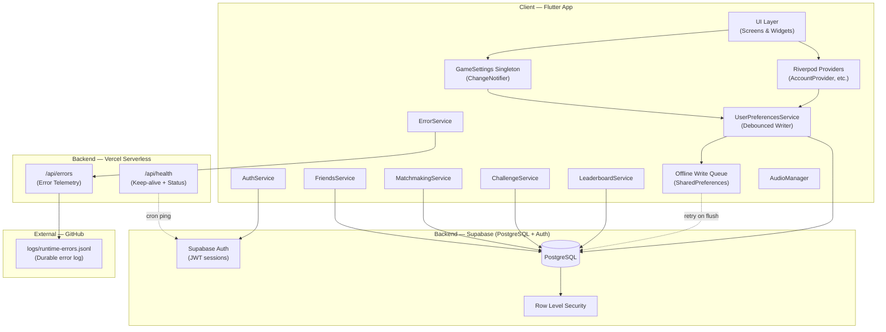

---

## Database Schema

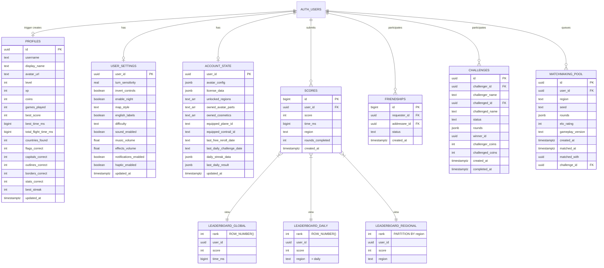

---

## Persistence Architecture

**Immediate flush triggers** (bypass 2s debounce):
- Game completion (`recordGameCompletion`)
- App lifecycle: `paused`, `hidden`, `detached`

**Periodic refresh**: Every 5 minutes, re-fetches from Supabase (skipped if pending writes exist).

---

## Flow 1 — On Login

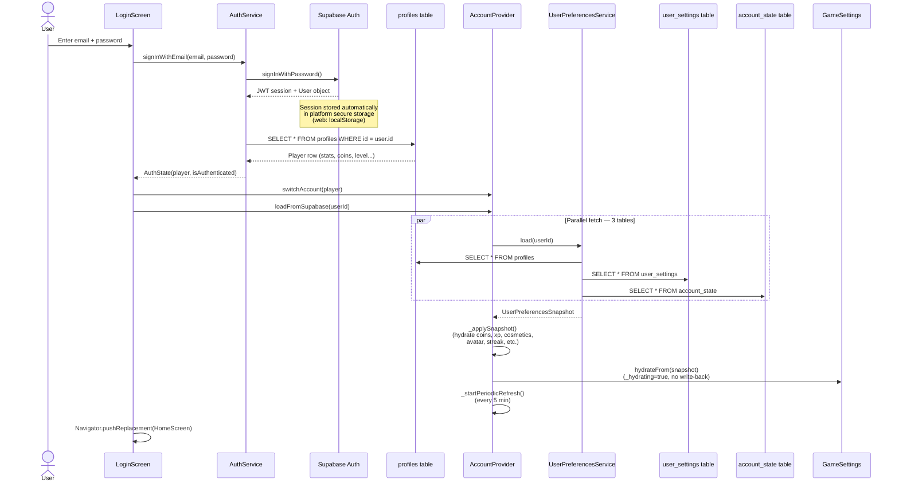

---

## Flow 2 — On Refresh (Already Logged In)

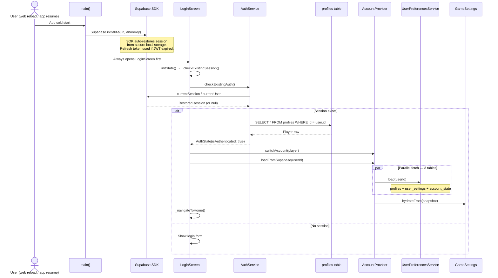

---

## Flow 3 — On Profile Page

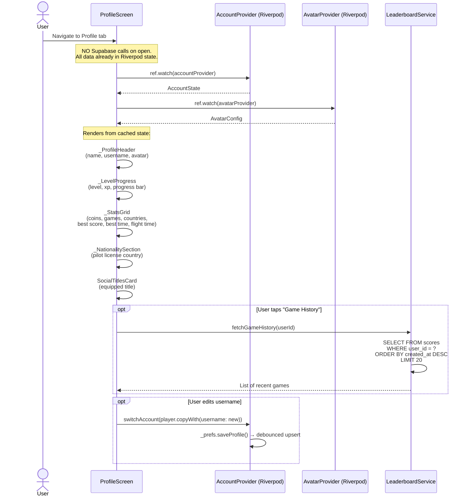

---

## Flow 4 — On Game Start

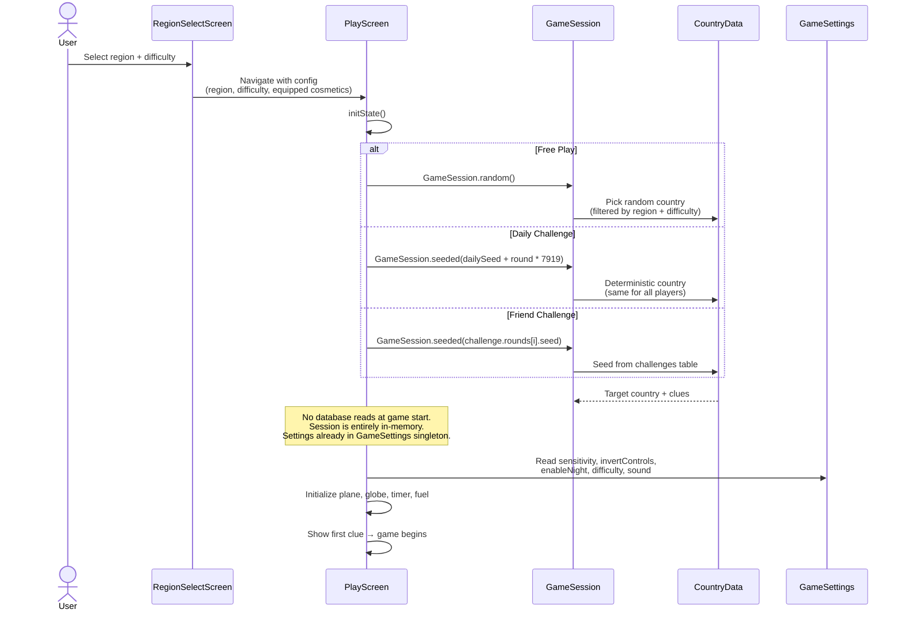

---

## Flow 5 — On Leaderboard Load

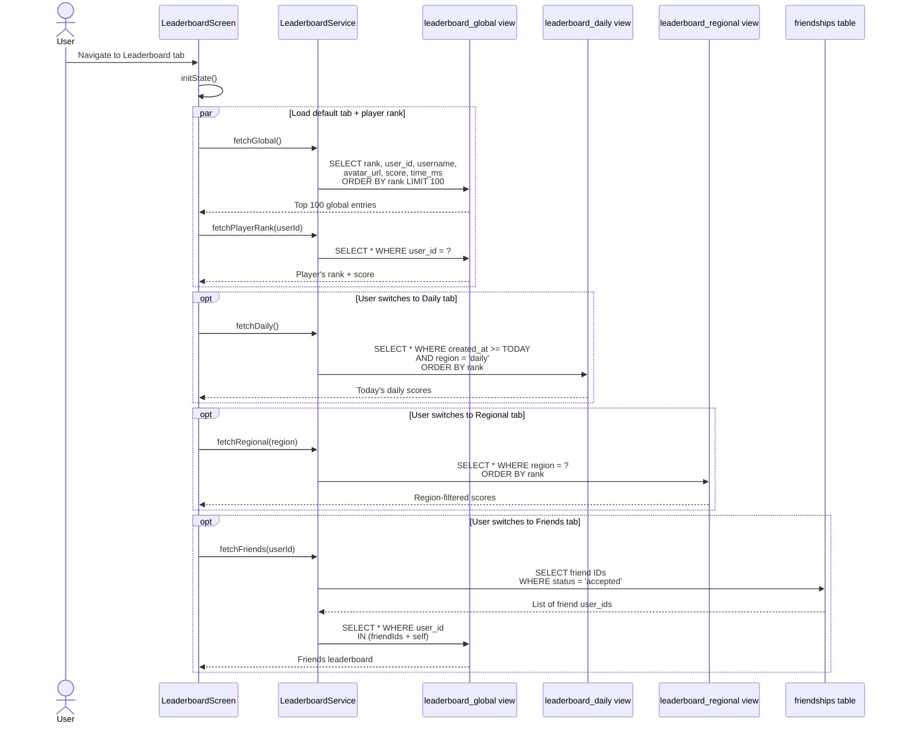

---

## Flow 6 — On Shop Purchase

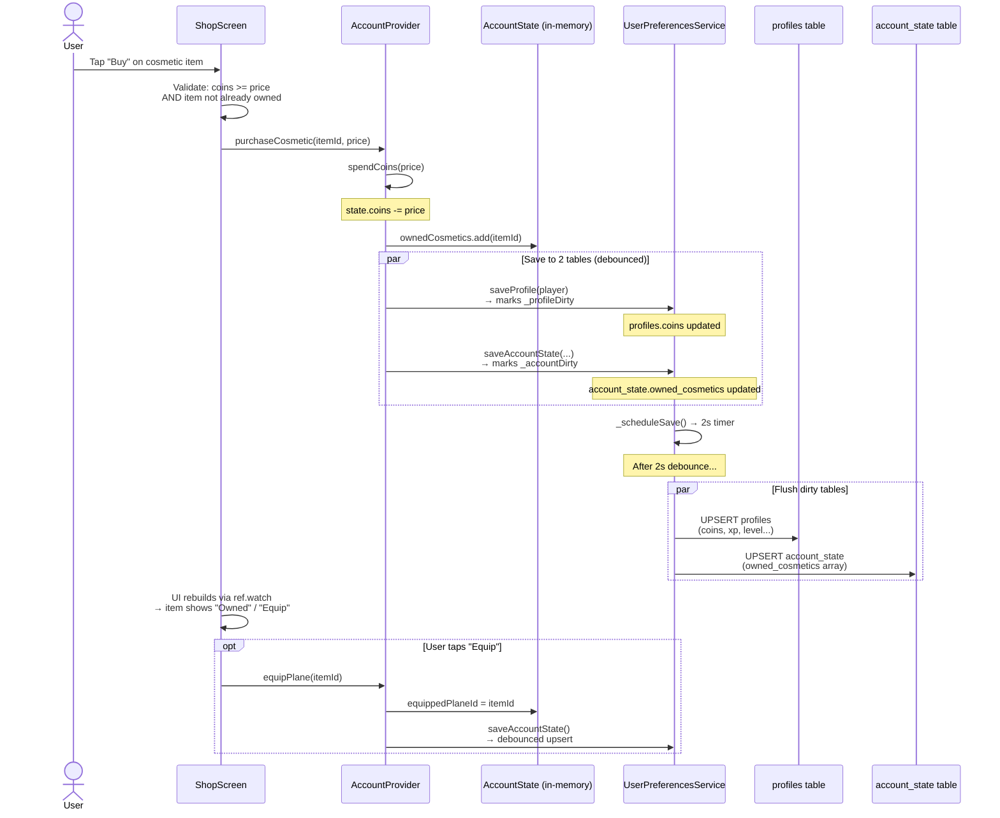

---

## Flow 7 — On Avatar Save

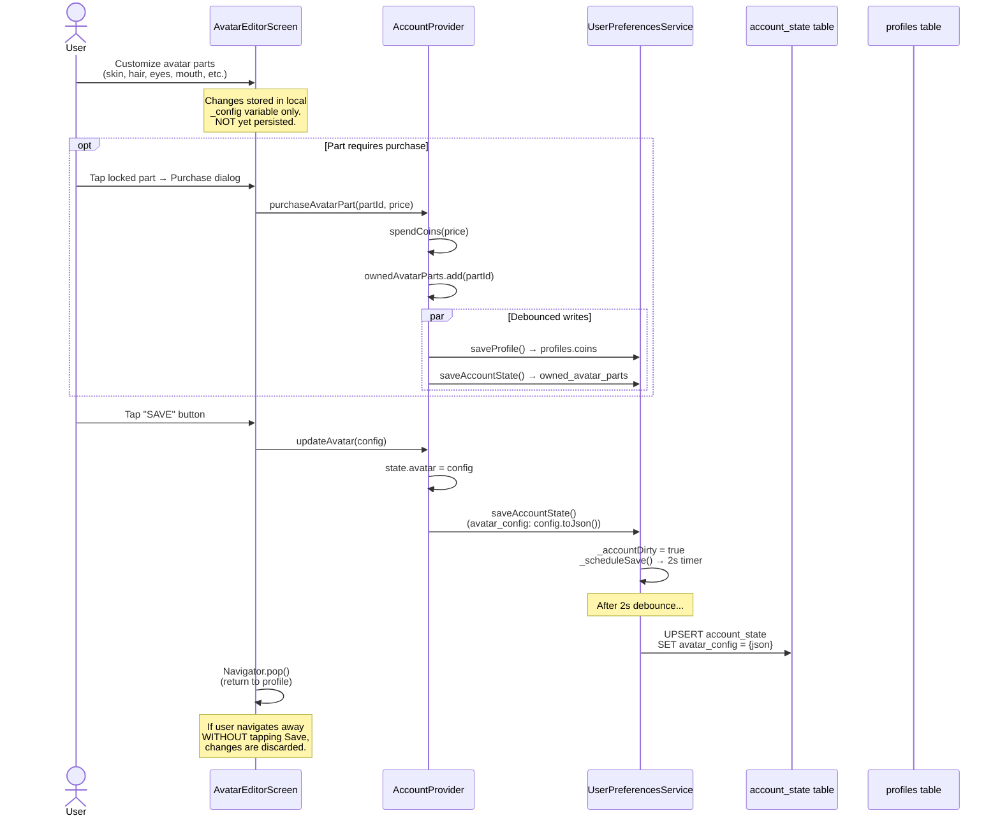

---

## Flow 8 — On Completing Daily Challenge

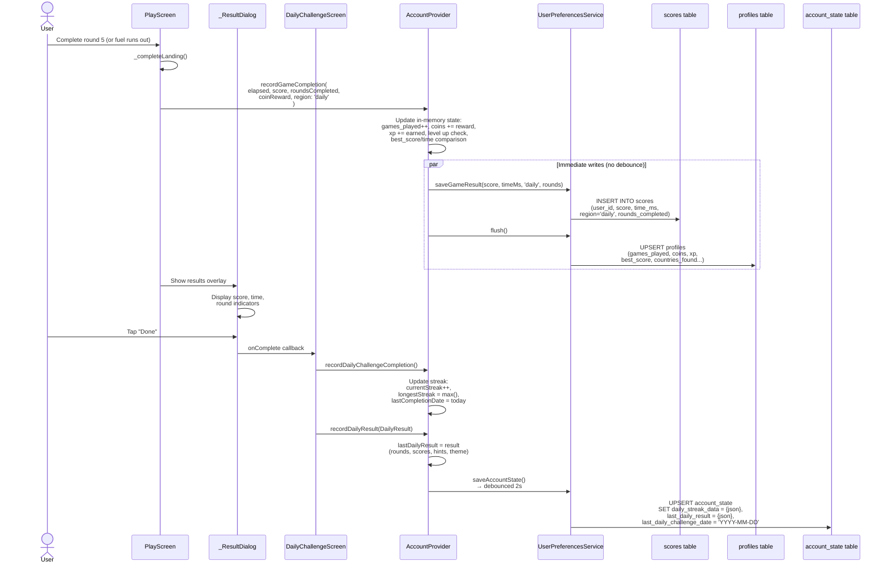

---

## Flow 9 — On Searching for Challengers (Matchmaking)

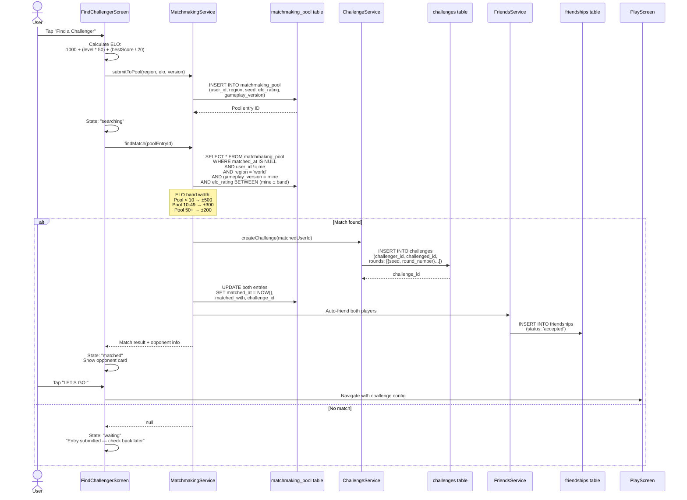

---

## Flow 10 — On Submitting a Challenge to Friend

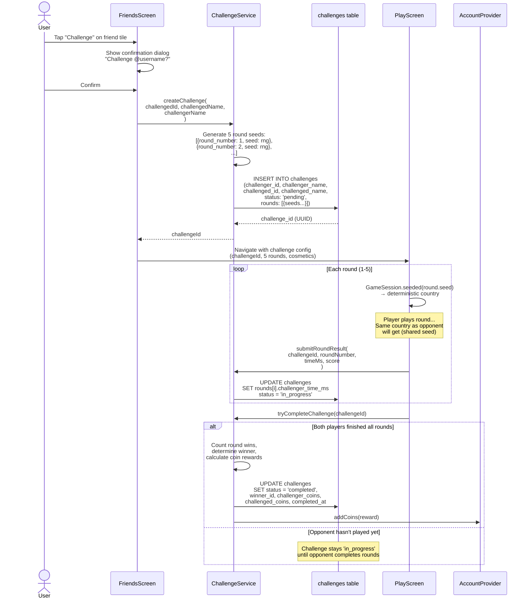

---

## Flow 11 — On Refining Game Settings

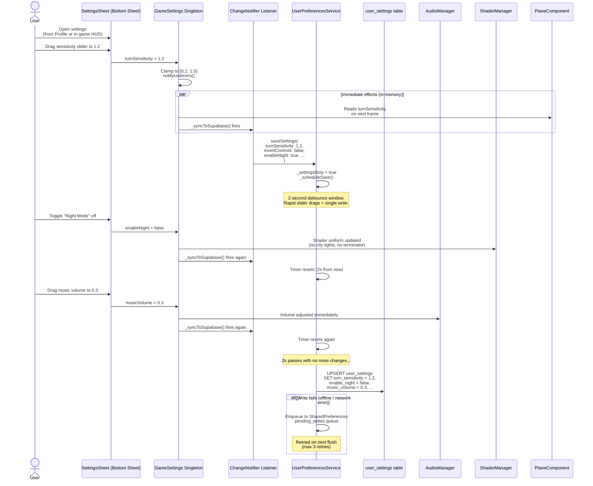

**Hydration guard**: On login, `hydrateFrom()` sets `_hydrating = true` to suppress `_syncToSupabase()` while populating fields from the database — preventing a circular write-back of the values just loaded.

---

## State Residence Summary

| Data | In-Memory Location | Persistent Location | Write Strategy |
|------|-------------------|---------------------|----------------|
| Auth session (JWT) | Supabase SDK | Platform secure storage | Automatic (SDK) |
| Player stats (level, xp, coins) | `AccountState` via Riverpod | `profiles` table | Debounced 2s upsert |
| Game settings | `GameSettings` singleton | `user_settings` table | Debounced 2s upsert |
| Avatar config | `AccountState.avatar` | `account_state.avatar_config` (JSONB) | Debounced 2s upsert |
| Owned cosmetics | `AccountState.ownedCosmetics` | `account_state.owned_cosmetics` (text[]) | Debounced 2s upsert |
| Equipped items | `AccountState.equippedPlaneId` etc. | `account_state.equipped_*` | Debounced 2s upsert |
| Daily streak | `AccountState.dailyStreakData` | `account_state.daily_streak_data` (JSONB) | Debounced 2s upsert |
| Last daily result | `AccountState.lastDailyResult` | `account_state.last_daily_result` (JSONB) | Debounced 2s upsert |
| Game scores | Transient (PlayScreen) | `scores` table | Immediate INSERT |
| Active game session | `GameSession` (local) | Nowhere (ephemeral) | Not persisted |
| Challenges | Fetched on demand | `challenges` table | Immediate INSERT/UPDATE |
| Friend list | Fetched on demand | `friendships` table | Immediate INSERT/UPDATE |
| Matchmaking entry | Fetched on demand | `matchmaking_pool` table | Immediate INSERT |
| Failed writes | — | `SharedPreferences` (pending_writes) | Retry on next flush |
| Error telemetry | — | Vercel in-memory + GitHub JSONL | POST on capture |

---

## Flush Trigger Map

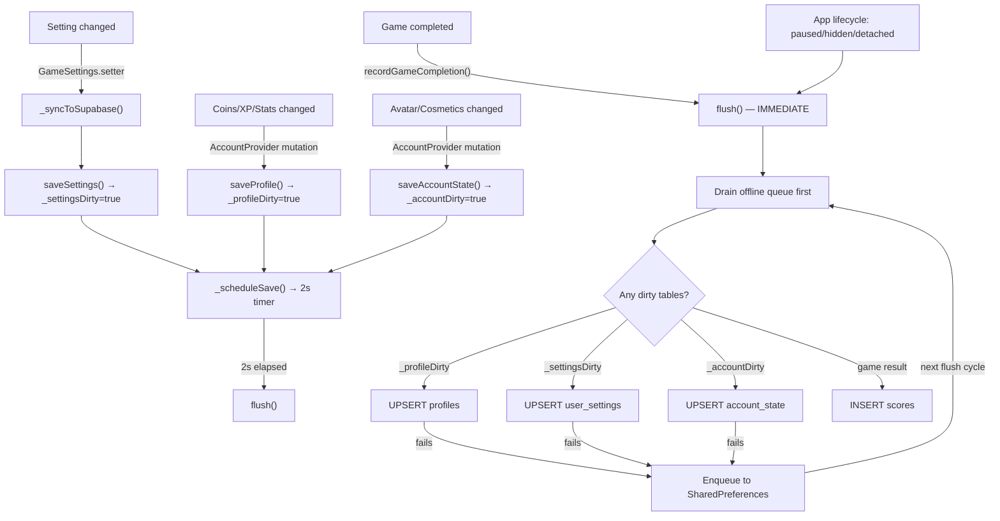

---

## Vercel Serverless Endpoints

| Endpoint | Method | Auth | Purpose |
|----------|--------|------|---------|
| `/api/errors` | POST | None (open) | Receive error reports from Flutter app |
| `/api/errors` | GET | X-API-Key header | Query stored errors (severity, since, limit) |
| `/api/health` | GET | None | Health check + Supabase keep-alive ping |

The health endpoint is hit by a Vercel cron every 3 days to prevent Supabase's free-tier auto-pause (7-day inactivity timeout).

---

## Key File Reference

| Component | File |
|-----------|------|
| App entry + lifecycle flush | `lib/main.dart` |
| Supabase config | `lib/core/config/supabase_config.dart` |
| Auth service | `lib/data/services/auth_service.dart` |
| Account provider (Riverpod) | `lib/data/providers/account_provider.dart` |
| Persistence service | `lib/data/services/user_preferences_service.dart` |
| Game settings singleton | `lib/core/services/game_settings.dart` |
| Settings UI | `lib/core/widgets/settings_sheet.dart` |
| Login screen | `lib/features/auth/login_screen.dart` |
| Profile screen | `lib/features/profile/profile_screen.dart` |
| Play screen (game) | `lib/features/play/play_screen.dart` |
| Daily challenge screen | `lib/features/daily/daily_challenge_screen.dart` |
| Shop screen | `lib/features/shop/shop_screen.dart` |
| Avatar editor | `lib/features/avatar/avatar_editor_screen.dart` |
| Leaderboard service | `lib/data/services/leaderboard_service.dart` |
| Challenge service | `lib/data/services/challenge_service.dart` |
| Matchmaking service | `lib/data/services/matchmaking_service.dart` |
| Friends service | `lib/data/services/friends_service.dart` |
| Error telemetry API | `api/errors/index.js` |
| Health check API | `api/health/index.js` |
| SQL migrations | `supabase/migrations/*.sql` |
