# Flit Architecture — State, Persistence & Flow Reference

> How game state, settings, and stats are preserved across every user interaction.

---

## System Overview

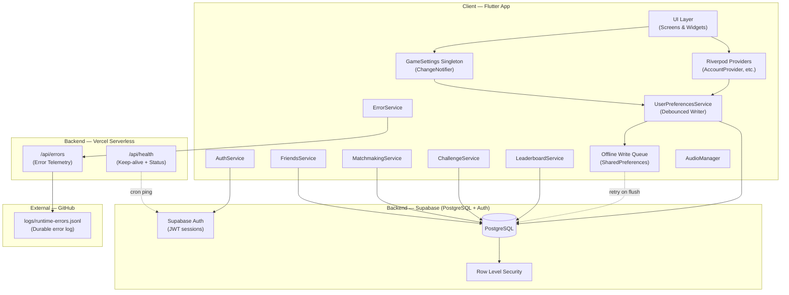
```mermaid
graph TB
    subgraph "Client — Flutter App"
        UI["UI Layer<br/>(Screens & Widgets)"]
        RP["Riverpod Providers<br/>(AccountProvider, etc.)"]
        GS["GameSettings Singleton<br/>(ChangeNotifier)"]
        UPS["UserPreferencesService<br/>(Debounced Writer)"]
        OQ["Offline Write Queue<br/>(SharedPreferences)"]
        AS["AuthService"]
        LS["LeaderboardService"]
        CS["ChallengeService"]
        MS["MatchmakingService"]
        FS["FriendsService"]
        ES["ErrorService"]
        AM["AudioManager"]
    end

    subgraph "Backend — Supabase (PostgreSQL + Auth)"
        SA["Supabase Auth<br/>(JWT sessions)"]
        DB[("PostgreSQL")]
        RLS["Row Level Security"]
    end

    subgraph "Backend — Vercel Serverless"
        VE["/api/errors<br/>(Error Telemetry)"]
        VH["/api/health<br/>(Keep-alive + Status)"]
    end

    subgraph "External — GitHub"
        GH["logs/runtime-errors.jsonl<br/>(Durable error log)"]
    end

    UI --> RP
    UI --> GS
    RP --> UPS
    GS --> UPS
    UPS --> DB
    UPS --> OQ
    OQ -.->|retry on flush| DB
    AS --> SA
    LS --> DB
    CS --> DB
    MS --> DB
    FS --> DB
    ES --> VE
    VE --> GH
    VH -.->|cron ping| SA
    DB --> RLS
```

---

## Database Schema


```mermaid
erDiagram
    AUTH_USERS ||--o| PROFILES : "trigger creates"
    AUTH_USERS ||--o| USER_SETTINGS : has
    AUTH_USERS ||--o| ACCOUNT_STATE : has
    AUTH_USERS ||--o{ SCORES : submits
    AUTH_USERS ||--o{ FRIENDSHIPS : participates
    AUTH_USERS ||--o{ CHALLENGES : participates
    AUTH_USERS ||--o{ MATCHMAKING_POOL : queues

    PROFILES {
        uuid id PK
        text username
        text display_name
        text avatar_url
        int level
        int xp
        int coins
        int games_played
        int best_score
        bigint best_time_ms
        bigint total_flight_time_ms
        int countries_found
        int flags_correct
        int capitals_correct
        int outlines_correct
        int borders_correct
        int stats_correct
        int best_streak
        timestamptz updated_at
    }

    USER_SETTINGS {
        uuid user_id PK
        real turn_sensitivity
        boolean invert_controls
        boolean enable_night
        text map_style
        boolean english_labels
        text difficulty
        boolean sound_enabled
        float music_volume
        float effects_volume
        boolean notifications_enabled
        boolean haptic_enabled
        timestamptz updated_at
    }

    ACCOUNT_STATE {
        uuid user_id PK
        jsonb avatar_config
        jsonb license_data
        text_arr unlocked_regions
        text_arr owned_avatar_parts
        text_arr owned_cosmetics
        text equipped_plane_id
        text equipped_contrail_id
        text last_free_reroll_date
        text last_daily_challenge_date
        jsonb daily_streak_data
        jsonb last_daily_result
        timestamptz updated_at
    }

    SCORES {
        bigint id PK
        uuid user_id FK
        int score
        bigint time_ms
        text region
        int rounds_completed
        timestamptz created_at
    }

    FRIENDSHIPS {
        bigint id PK
        uuid requester_id FK
        uuid addressee_id FK
        text status
        timestamptz created_at
    }

    CHALLENGES {
        uuid id PK
        uuid challenger_id FK
        text challenger_name
        uuid challenged_id FK
        text challenged_name
        text status
        jsonb rounds
        uuid winner_id
        int challenger_coins
        int challenged_coins
        timestamptz created_at
        timestamptz completed_at
    }

    MATCHMAKING_POOL {
        uuid id PK
        uuid user_id FK
        text region
        text seed
        jsonb rounds
        int elo_rating
        text gameplay_version
        timestamptz created_at
        timestamptz matched_at
        uuid matched_with
        uuid challenge_id FK
    }

    SCORES }|--|| LEADERBOARD_GLOBAL : "view"
    SCORES }|--|| LEADERBOARD_DAILY : "view"
    SCORES }|--|| LEADERBOARD_REGIONAL : "view"

    LEADERBOARD_GLOBAL {
        int rank "ROW_NUMBER()"
        uuid user_id
        int score
        bigint time_ms
    }

    LEADERBOARD_DAILY {
        int rank "ROW_NUMBER()"
        uuid user_id
        int score
        text region "= daily"
    }

    LEADERBOARD_REGIONAL {
        int rank "PARTITION BY region"
        uuid user_id
        int score
        text region
    }
```

---

## Persistence Architecture

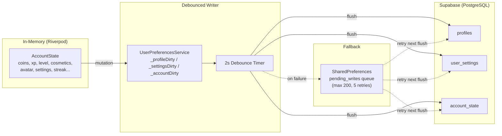
```mermaid
graph LR
    subgraph "In-Memory (Riverpod)"
        A["AccountState<br/>coins, xp, level, cosmetics,<br/>avatar, settings, streak..."]
    end

    subgraph "Debounced Writer"
        B["UserPreferencesService<br/>_profileDirty / _settingsDirty / _accountDirty"]
        T["2s Debounce Timer"]
    end

    subgraph "Supabase (PostgreSQL)"
        P["profiles"]
        S["user_settings"]
        AS2["account_state"]
    end

    subgraph "Fallback"
        Q["SharedPreferences<br/>pending_writes queue<br/>(max 200, 5 retries)"]
    end

    A -->|mutation| B
    B --> T
    T -->|flush| P
    T -->|flush| S
    T -->|flush| AS2
    T -.->|on failure| Q
    Q -.->|retry next flush| P
    Q -.->|retry next flush| S
    Q -.->|retry next flush| AS2
```

**Immediate flush triggers** (bypass 2s debounce):
- Game completion (`recordGameCompletion`)
- App lifecycle: `paused`, `hidden`, `detached`

**Periodic refresh**: Every 5 minutes, re-fetches from Supabase (skipped if pending writes exist).

---

## Flow 1 — On Login

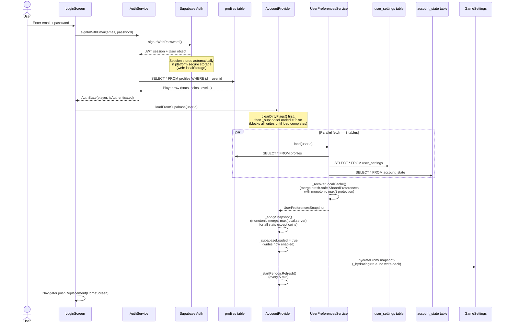
```mermaid
sequenceDiagram
    actor User
    participant LoginScreen
    participant AuthService
    participant SupabaseAuth as Supabase Auth
    participant ProfilesDB as profiles table
    participant AccountProvider
    participant UserPrefsService as UserPreferencesService
    participant SettingsDB as user_settings table
    participant AccountDB as account_state table
    participant GameSettings

    User->>LoginScreen: Enter email + password
    LoginScreen->>AuthService: signInWithEmail(email, password)
    AuthService->>SupabaseAuth: signInWithPassword()
    SupabaseAuth-->>AuthService: JWT session + User object

    Note over SupabaseAuth: Session stored automatically<br/>in platform secure storage<br/>(web: localStorage)

    AuthService->>ProfilesDB: SELECT * FROM profiles WHERE id = user.id
    ProfilesDB-->>AuthService: Player row (stats, coins, level...)
    AuthService-->>LoginScreen: AuthState(player, isAuthenticated)

    LoginScreen->>AccountProvider: loadFromSupabase(userId)

    Note over AccountProvider: clearDirtyFlags() first,<br/>then _supabaseLoaded = false<br/>(blocks all writes until load completes)

    par Parallel fetch — 3 tables
        AccountProvider->>UserPrefsService: load(userId)
        UserPrefsService->>ProfilesDB: SELECT * FROM profiles
        UserPrefsService->>SettingsDB: SELECT * FROM user_settings
        UserPrefsService->>AccountDB: SELECT * FROM account_state
    end

    UserPrefsService->>UserPrefsService: _recoverLocalCache()<br/>(merge crash-safe SharedPreferences<br/>with monotonic max() protection)
    UserPrefsService-->>AccountProvider: UserPreferencesSnapshot

    AccountProvider->>AccountProvider: _applySnapshot()<br/>(monotonic merge: max(local,server)<br/>for all stats except coins)
    AccountProvider->>AccountProvider: _supabaseLoaded = true<br/>(writes now enabled)
    AccountProvider->>GameSettings: hydrateFrom(snapshot)<br/>(_hydrating=true, no write-back)
    AccountProvider->>AccountProvider: _startPeriodicRefresh()<br/>(every 5 min)

    LoginScreen->>LoginScreen: Navigator.pushReplacement(HomeScreen)
```

---

## Flow 2 — On Refresh (Already Logged In)

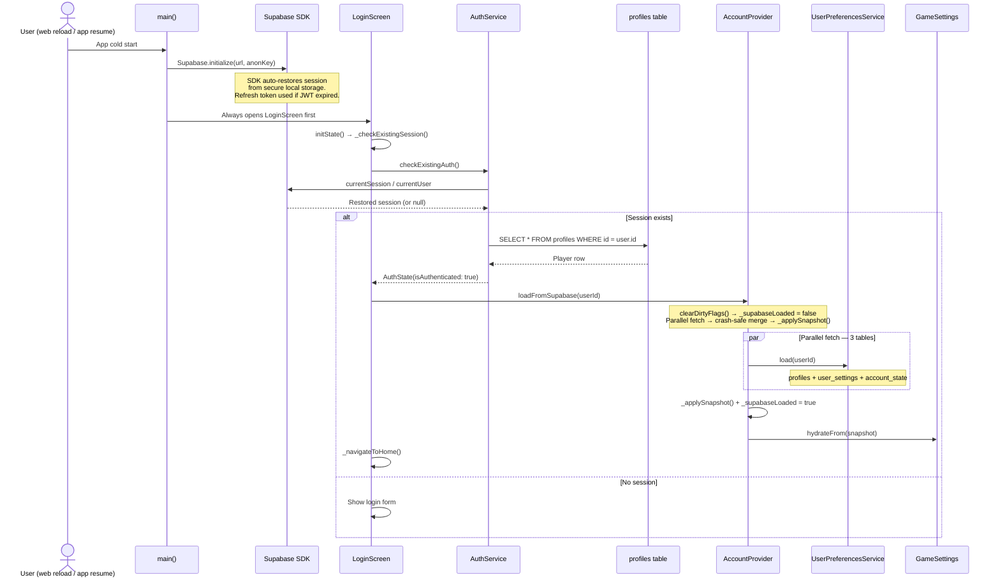
```mermaid
sequenceDiagram
    actor Browser as User (web reload / app resume)
    participant Main as main()
    participant SupabaseSDK as Supabase SDK
    participant LoginScreen
    participant AuthService
    participant ProfilesDB as profiles table
    participant AccountProvider
    participant UserPrefsService as UserPreferencesService
    participant GameSettings

    Browser->>Main: App cold start
    Main->>SupabaseSDK: Supabase.initialize(url, anonKey)

    Note over SupabaseSDK: SDK auto-restores session<br/>from secure local storage.<br/>Refresh token used if JWT expired.

    Main->>LoginScreen: Always opens LoginScreen first

    LoginScreen->>LoginScreen: initState() → _checkExistingSession()
    LoginScreen->>AuthService: checkExistingAuth()
    AuthService->>SupabaseSDK: currentSession / currentUser
    SupabaseSDK-->>AuthService: Restored session (or null)

    alt Session exists
        AuthService->>ProfilesDB: SELECT * FROM profiles WHERE id = user.id
        ProfilesDB-->>AuthService: Player row
        AuthService-->>LoginScreen: AuthState(isAuthenticated: true)

        LoginScreen->>AccountProvider: loadFromSupabase(userId)

        Note over AccountProvider: clearDirtyFlags() → _supabaseLoaded = false<br/>Parallel fetch → crash-safe merge → _applySnapshot()

        par Parallel fetch — 3 tables
            AccountProvider->>UserPrefsService: load(userId)
            Note over UserPrefsService: profiles + user_settings + account_state
        end

        AccountProvider->>AccountProvider: _applySnapshot() + _supabaseLoaded = true
        AccountProvider->>GameSettings: hydrateFrom(snapshot)
        LoginScreen->>LoginScreen: _navigateToHome()
    else No session
        LoginScreen->>LoginScreen: Show login form
    end
```

---

## Flow 3 — On Profile Page

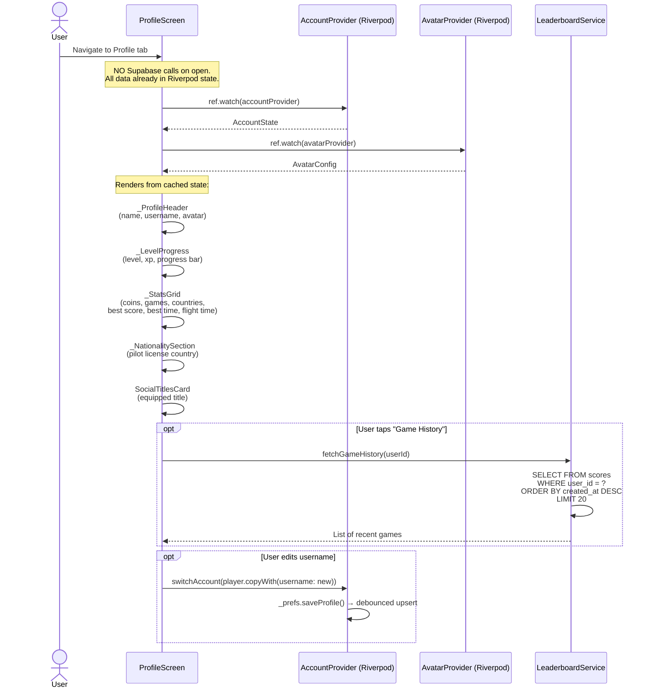
```mermaid
sequenceDiagram
    actor User
    participant ProfileScreen
    participant AccountProvider as AccountProvider (Riverpod)
    participant AvatarProvider as AvatarProvider (Riverpod)
    participant LeaderboardService

    User->>ProfileScreen: Navigate to Profile tab

    Note over ProfileScreen: NO Supabase calls on open.<br/>All data already in Riverpod state.

    ProfileScreen->>AccountProvider: ref.watch(accountProvider)
    AccountProvider-->>ProfileScreen: AccountState

    ProfileScreen->>AvatarProvider: ref.watch(avatarProvider)
    AvatarProvider-->>ProfileScreen: AvatarConfig

    Note over ProfileScreen: Renders from cached state:

    ProfileScreen->>ProfileScreen: _ProfileHeader<br/>(name, username, avatar)
    ProfileScreen->>ProfileScreen: _LevelProgress<br/>(level, xp, progress bar)
    ProfileScreen->>ProfileScreen: _StatsGrid<br/>(coins, games, countries,<br/>best score, best time, flight time)
    ProfileScreen->>ProfileScreen: _NationalitySection<br/>(pilot license country)
    ProfileScreen->>ProfileScreen: SocialTitlesCard<br/>(equipped title)

    opt User taps "Game History"
        ProfileScreen->>LeaderboardService: fetchGameHistory(userId)
        LeaderboardService->>LeaderboardService: SELECT FROM scores<br/>WHERE user_id = ?<br/>ORDER BY created_at DESC<br/>LIMIT 20
        LeaderboardService-->>ProfileScreen: List of recent games
    end

    opt User edits username
        ProfileScreen->>AccountProvider: switchAccount(player.copyWith(username: new))
        AccountProvider->>AccountProvider: _prefs.saveProfile() → debounced upsert
    end
```

---

## Flow 4 — On Game Start

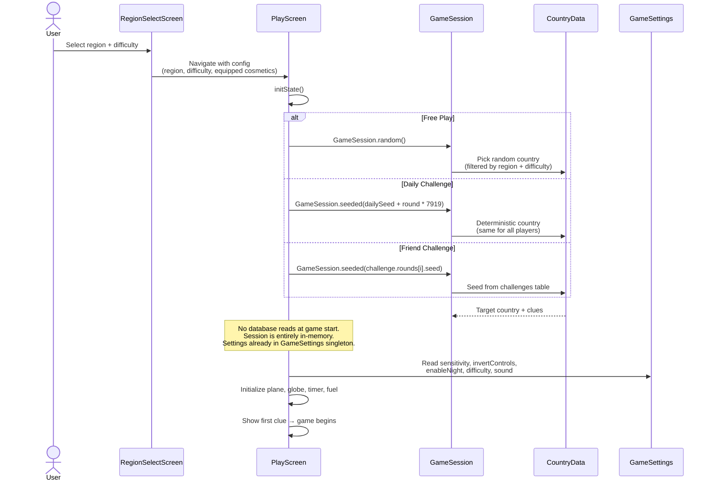
```mermaid
sequenceDiagram
    actor User
    participant RegionSelect as RegionSelectScreen
    participant PlayScreen
    participant GameSession
    participant CountryData
    participant GameSettings

    User->>RegionSelect: Select region + difficulty
    RegionSelect->>PlayScreen: Navigate with config<br/>(region, difficulty, equipped cosmetics)

    PlayScreen->>PlayScreen: initState()

    alt Free Play
        PlayScreen->>GameSession: GameSession.random()
        GameSession->>CountryData: Pick random country<br/>(filtered by region + difficulty)
    else Daily Challenge
        PlayScreen->>GameSession: GameSession.seeded(dailySeed + round * 7919)
        GameSession->>CountryData: Deterministic country<br/>(same for all players)
    else Friend Challenge
        PlayScreen->>GameSession: GameSession.seeded(challenge.rounds[i].seed)
        GameSession->>CountryData: Seed from challenges table
    end

    CountryData-->>GameSession: Target country + clues

    Note over PlayScreen: No database reads at game start.<br/>Session is entirely in-memory.<br/>Settings already in GameSettings singleton.

    PlayScreen->>GameSettings: Read sensitivity, invertControls,<br/>enableNight, difficulty, sound
    PlayScreen->>PlayScreen: Initialize plane, globe, timer, fuel
    PlayScreen->>PlayScreen: Show first clue → game begins
```

---

## Flow 5 — On Leaderboard Load

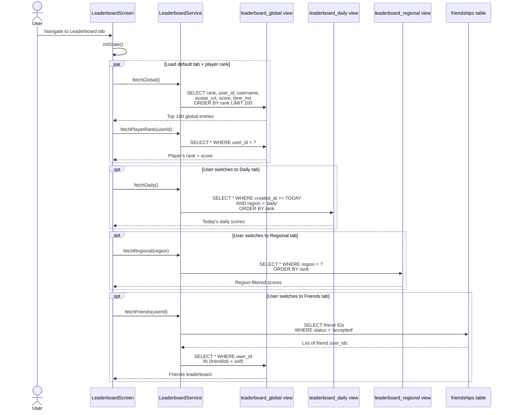
```mermaid
sequenceDiagram
    actor User
    participant LBScreen as LeaderboardScreen
    participant LBService as LeaderboardService
    participant GlobalView as leaderboard_global view
    participant DailyView as leaderboard_daily view
    participant RegionalView as leaderboard_regional view
    participant FriendshipsDB as friendships table

    User->>LBScreen: Navigate to Leaderboard tab
    LBScreen->>LBScreen: initState()

    par Load default tab + player rank
        LBScreen->>LBService: fetchGlobal()
        LBService->>GlobalView: SELECT rank, user_id, username,<br/>avatar_url, score, time_ms<br/>ORDER BY rank LIMIT 100
        GlobalView-->>LBScreen: Top 100 global entries

        LBScreen->>LBService: fetchPlayerRank(userId)
        LBService->>GlobalView: SELECT * WHERE user_id = ?
        GlobalView-->>LBScreen: Player's rank + score
    end

    opt User switches to Daily tab
        LBScreen->>LBService: fetchDaily()
        LBService->>DailyView: SELECT * WHERE created_at >= TODAY<br/>AND region = 'daily'<br/>ORDER BY rank
        DailyView-->>LBScreen: Today's daily scores
    end

    opt User switches to Regional tab
        LBScreen->>LBService: fetchRegional(region)
        LBService->>RegionalView: SELECT * WHERE region = ?<br/>ORDER BY rank
        RegionalView-->>LBScreen: Region-filtered scores
    end

    opt User switches to Friends tab
        LBScreen->>LBService: fetchFriends(userId)
        LBService->>FriendshipsDB: SELECT friend IDs<br/>WHERE status = 'accepted'
        FriendshipsDB-->>LBService: List of friend user_ids
        LBService->>GlobalView: SELECT * WHERE user_id<br/>IN (friendIds + self)
        GlobalView-->>LBScreen: Friends leaderboard
    end
```

---

## Flow 6 — On Shop Purchase

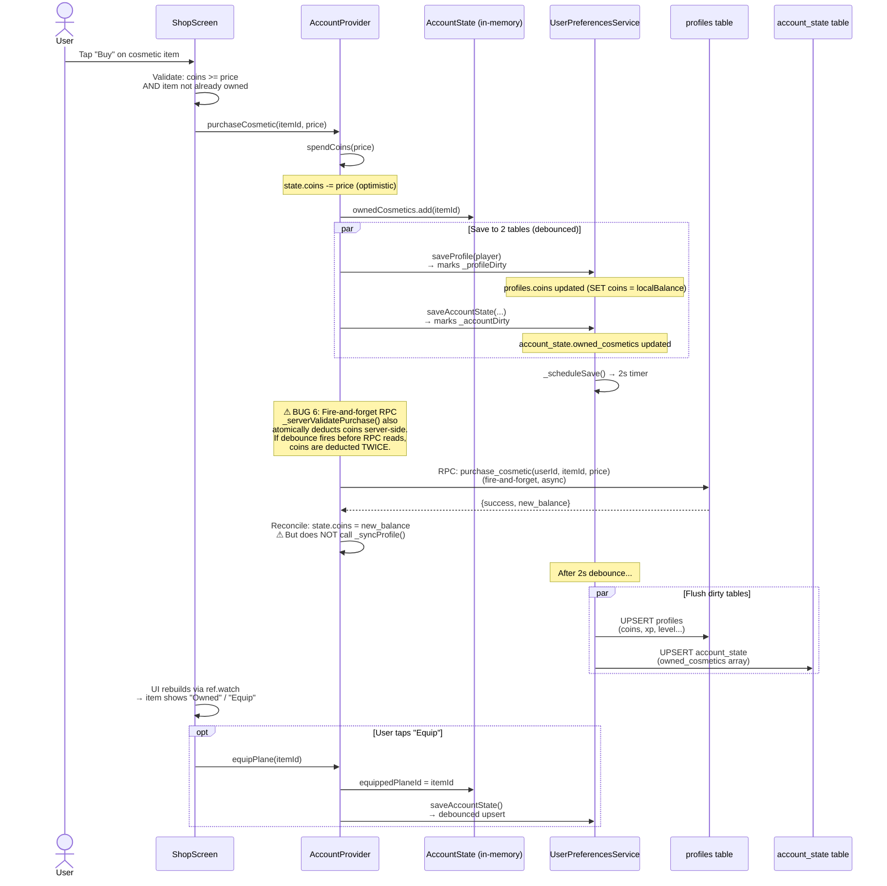
```mermaid
sequenceDiagram
    actor User
    participant ShopScreen
    participant AccountProvider
    participant AccountState as AccountState (in-memory)
    participant UserPrefsService as UserPreferencesService
    participant ProfilesDB as profiles table
    participant AccountDB as account_state table

    User->>ShopScreen: Tap "Buy" on cosmetic item

    ShopScreen->>ShopScreen: Validate: coins >= price<br/>AND item not already owned

    ShopScreen->>AccountProvider: purchaseCosmetic(itemId, price)

    AccountProvider->>AccountProvider: spendCoins(price)
    Note over AccountProvider: state.coins -= price (optimistic)

    AccountProvider->>AccountState: ownedCosmetics.add(itemId)

    par Save to 2 tables (debounced)
        AccountProvider->>UserPrefsService: saveProfile(player)<br/>→ marks _profileDirty
        Note over UserPrefsService: profiles.coins updated (SET coins = localBalance)
        AccountProvider->>UserPrefsService: saveAccountState(...)<br/>→ marks _accountDirty
        Note over UserPrefsService: account_state.owned_cosmetics updated
    end

    UserPrefsService->>UserPrefsService: _scheduleSave() → 2s timer

    Note over AccountProvider: ⚠ BUG 6: Fire-and-forget RPC<br/>_serverValidatePurchase() also<br/>atomically deducts coins server-side.<br/>If debounce fires before RPC reads,<br/>coins are deducted TWICE.

    AccountProvider->>ProfilesDB: RPC: purchase_cosmetic(userId, itemId, price)<br/>(fire-and-forget, async)
    ProfilesDB-->>AccountProvider: {success, new_balance}
    AccountProvider->>AccountProvider: Reconcile: state.coins = new_balance<br/>⚠ But does NOT call _syncProfile()

    Note over UserPrefsService: After 2s debounce...

    par Flush dirty tables
        UserPrefsService->>ProfilesDB: UPSERT profiles<br/>(coins, xp, level...)
        UserPrefsService->>AccountDB: UPSERT account_state<br/>(owned_cosmetics array)
    end

    ShopScreen->>ShopScreen: UI rebuilds via ref.watch<br/>→ item shows "Owned" / "Equip"

    opt User taps "Equip"
        ShopScreen->>AccountProvider: equipPlane(itemId)
        AccountProvider->>AccountState: equippedPlaneId = itemId
        AccountProvider->>UserPrefsService: saveAccountState()<br/>→ debounced upsert
    end
```

---

## Flow 7 — On Avatar Save

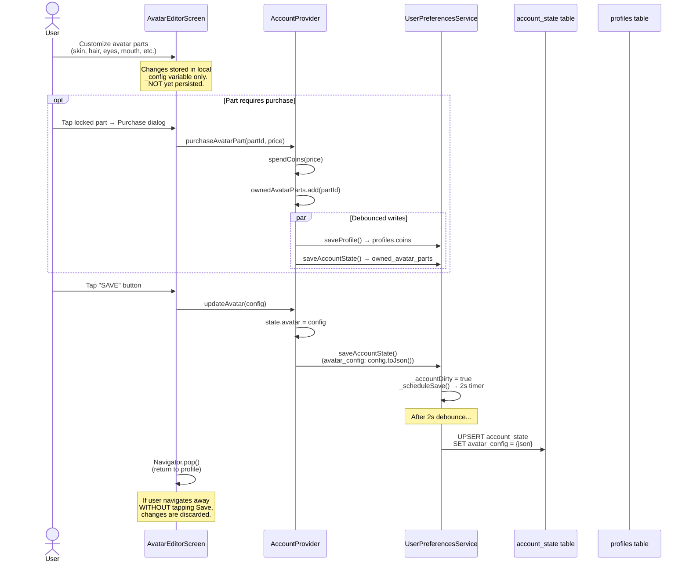
```mermaid
sequenceDiagram
    actor User
    participant AvatarEditor as AvatarEditorScreen
    participant AccountProvider
    participant UserPrefsService as UserPreferencesService
    participant AccountDB as account_state table
    participant ProfilesDB as profiles table

    User->>AvatarEditor: Customize avatar parts<br/>(skin, hair, eyes, mouth, etc.)

    Note over AvatarEditor: Changes stored in local<br/>_config variable only.<br/>NOT yet persisted.

    opt Part requires purchase
        User->>AvatarEditor: Tap locked part → Purchase dialog
        AvatarEditor->>AccountProvider: purchaseAvatarPart(partId, price)
        AccountProvider->>AccountProvider: spendCoins(price)
        AccountProvider->>AccountProvider: ownedAvatarParts.add(partId)
        par Debounced writes
            AccountProvider->>UserPrefsService: saveProfile() → profiles.coins
            AccountProvider->>UserPrefsService: saveAccountState() → owned_avatar_parts
        end
    end

    User->>AvatarEditor: Tap "SAVE" button

    AvatarEditor->>AccountProvider: updateAvatar(config)
    AccountProvider->>AccountProvider: state.avatar = config
    AccountProvider->>UserPrefsService: saveAccountState()<br/>(avatar_config: config.toJson())
    UserPrefsService->>UserPrefsService: _accountDirty = true<br/>_scheduleSave() → 2s timer

    Note over UserPrefsService: After 2s debounce...

    UserPrefsService->>AccountDB: UPSERT account_state<br/>SET avatar_config = {json}

    AvatarEditor->>AvatarEditor: Navigator.pop()<br/>(return to profile)

    Note over AvatarEditor: If user navigates away<br/>WITHOUT tapping Save,<br/>changes are discarded.
```

---

## Flow 8 — On Completing Daily Challenge

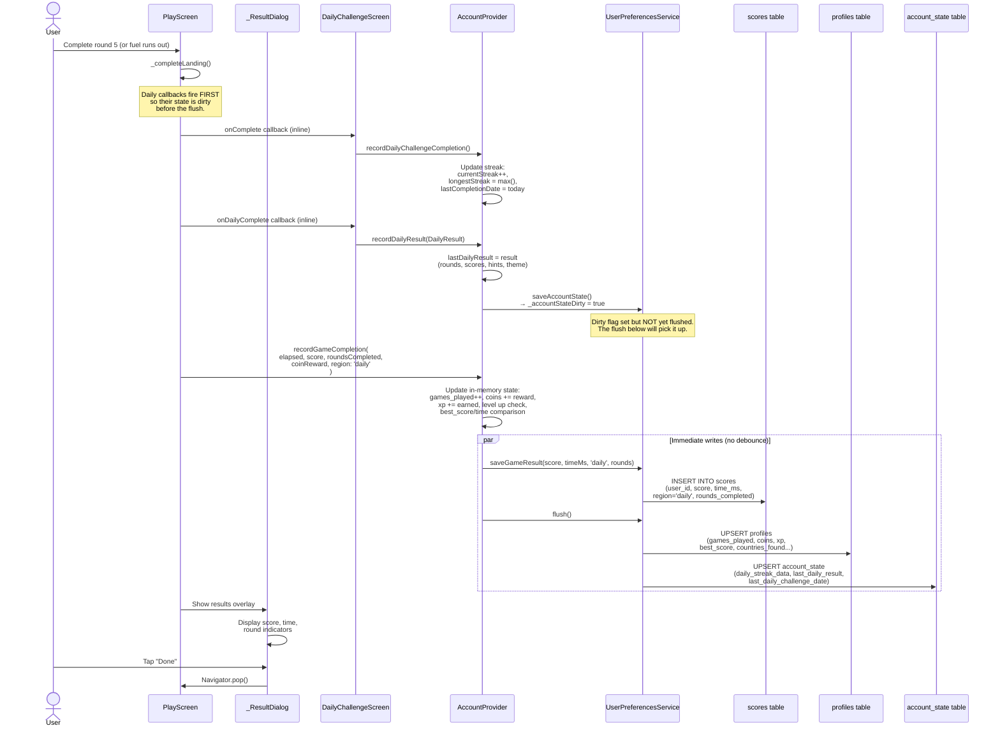
```mermaid
sequenceDiagram
    actor User
    participant PlayScreen
    participant ResultDialog as _ResultDialog
    participant DailyScreen as DailyChallengeScreen
    participant AccountProvider
    participant UserPrefsService as UserPreferencesService
    participant ScoresDB as scores table
    participant ProfilesDB as profiles table
    participant AccountDB as account_state table

    User->>PlayScreen: Complete round 5 (or fuel runs out)

    PlayScreen->>PlayScreen: _completeLanding()

    Note over PlayScreen: Daily callbacks fire FIRST<br/>so their state is dirty<br/>before the flush.

    PlayScreen->>DailyScreen: onComplete callback (inline)
    DailyScreen->>AccountProvider: recordDailyChallengeCompletion()

    AccountProvider->>AccountProvider: Update streak:<br/>currentStreak++,<br/>longestStreak = max(),<br/>lastCompletionDate = today

    PlayScreen->>DailyScreen: onDailyComplete callback (inline)
    DailyScreen->>AccountProvider: recordDailyResult(DailyResult)

    AccountProvider->>AccountProvider: lastDailyResult = result<br/>(rounds, scores, hints, theme)

    AccountProvider->>UserPrefsService: saveAccountState()<br/>→ _accountStateDirty = true

    Note over UserPrefsService: Dirty flag set but NOT yet flushed.<br/>The flush below will pick it up.

    PlayScreen->>AccountProvider: recordGameCompletion(<br/>  elapsed, score, roundsCompleted,<br/>  coinReward, region: 'daily'<br/>)

    AccountProvider->>AccountProvider: Update in-memory state:<br/>games_played++, coins += reward,<br/>xp += earned, level up check,<br/>best_score/time comparison

    par Immediate writes (no debounce)
        AccountProvider->>UserPrefsService: saveGameResult(score, timeMs, 'daily', rounds)
        UserPrefsService->>ScoresDB: INSERT INTO scores<br/>(user_id, score, time_ms,<br/>region='daily', rounds_completed)

        AccountProvider->>UserPrefsService: flush()
        UserPrefsService->>ProfilesDB: UPSERT profiles<br/>(games_played, coins, xp,<br/>best_score, countries_found...)
        UserPrefsService->>AccountDB: UPSERT account_state<br/>(daily_streak_data, last_daily_result,<br/>last_daily_challenge_date)
    end

    PlayScreen->>ResultDialog: Show results overlay

    ResultDialog->>ResultDialog: Display score, time,<br/>round indicators

    User->>ResultDialog: Tap "Done"
    ResultDialog->>PlayScreen: Navigator.pop()
```

---

## Flow 9 — On Searching for Challengers (Matchmaking)

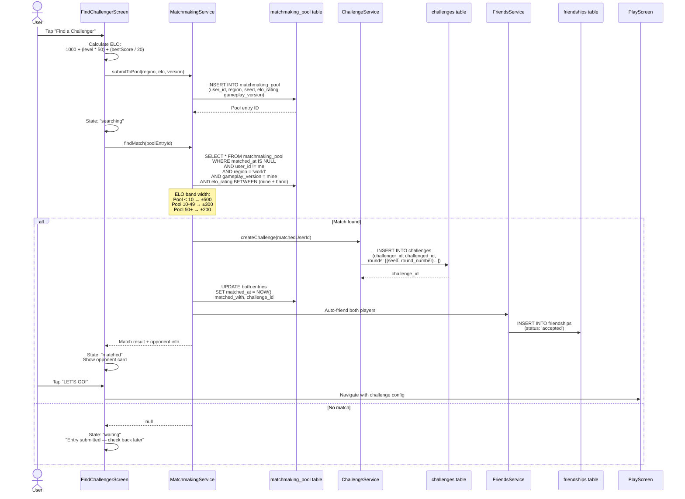
```mermaid
sequenceDiagram
    actor User
    participant FindScreen as FindChallengerScreen
    participant MatchService as MatchmakingService
    participant PoolDB as matchmaking_pool table
    participant ChallengeService
    participant ChallengesDB as challenges table
    participant FriendsService
    participant FriendshipsDB as friendships table
    participant PlayScreen

    User->>FindScreen: Tap "Find a Challenger"

    FindScreen->>FindScreen: Calculate ELO:<br/>1000 + (level * 50) + (bestScore / 20)

    FindScreen->>MatchService: submitToPool(region, elo, version)
    MatchService->>PoolDB: INSERT INTO matchmaking_pool<br/>(user_id, region, seed, elo_rating,<br/>gameplay_version)
    PoolDB-->>MatchService: Pool entry ID

    FindScreen->>FindScreen: State: "searching"

    FindScreen->>MatchService: findMatch(poolEntryId)

    MatchService->>PoolDB: SELECT * FROM matchmaking_pool<br/>WHERE matched_at IS NULL<br/>AND user_id != me<br/>AND region = 'world'<br/>AND gameplay_version = mine<br/>AND elo_rating BETWEEN (mine ± band)

    Note over MatchService: ELO band width:<br/>Pool < 10 → ±500<br/>Pool 10-49 → ±300<br/>Pool 50+ → ±200

    alt Match found
        MatchService->>ChallengeService: createChallenge(matchedUserId)
        ChallengeService->>ChallengesDB: INSERT INTO challenges<br/>(challenger_id, challenged_id,<br/>rounds: [{seed, round_number}...])
        ChallengesDB-->>ChallengeService: challenge_id

        MatchService->>PoolDB: UPDATE both entries<br/>SET matched_at = NOW(),<br/>matched_with, challenge_id

        MatchService->>FriendsService: Auto-friend both players
        FriendsService->>FriendshipsDB: INSERT INTO friendships<br/>(status: 'accepted')

        MatchService-->>FindScreen: Match result + opponent info

        FindScreen->>FindScreen: State: "matched"<br/>Show opponent card

        User->>FindScreen: Tap "LET'S GO!"
        FindScreen->>PlayScreen: Navigate with challenge config
    else No match
        MatchService-->>FindScreen: null
        FindScreen->>FindScreen: State: "waiting"<br/>"Entry submitted — check back later"
    end
```

---

## Flow 10 — On Submitting a Challenge to Friend

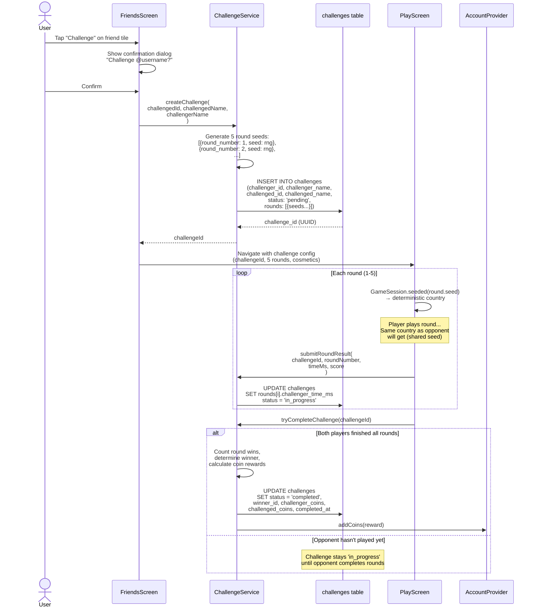
```mermaid
sequenceDiagram
    actor User
    participant FriendsScreen
    participant ChallengeService
    participant ChallengesDB as challenges table
    participant PlayScreen
    participant AccountProvider

    User->>FriendsScreen: Tap "Challenge" on friend tile

    FriendsScreen->>FriendsScreen: Show confirmation dialog<br/>"Challenge @username?"

    User->>FriendsScreen: Confirm

    FriendsScreen->>ChallengeService: createChallenge(<br/>  challengedId, challengedName,<br/>  challengerName<br/>)

    ChallengeService->>ChallengeService: Generate 5 round seeds:<br/>[{round_number: 1, seed: rng},<br/> {round_number: 2, seed: rng},<br/> ...]

    ChallengeService->>ChallengesDB: INSERT INTO challenges<br/>(challenger_id, challenger_name,<br/>challenged_id, challenged_name,<br/>status: 'pending',<br/>rounds: [{seeds...}])
    ChallengesDB-->>ChallengeService: challenge_id (UUID)

    ChallengeService-->>FriendsScreen: challengeId

    FriendsScreen->>PlayScreen: Navigate with challenge config<br/>(challengeId, 5 rounds, cosmetics)

    loop Each round (1-5)
        PlayScreen->>PlayScreen: GameSession.seeded(round.seed)<br/>→ deterministic country

        Note over PlayScreen: Player plays round...<br/>Same country as opponent<br/>will get (shared seed)

        PlayScreen->>ChallengeService: submitRoundResult(<br/>  challengeId, roundNumber,<br/>  timeMs, score<br/>)
        ChallengeService->>ChallengesDB: UPDATE challenges<br/>SET rounds[i].challenger_time_ms<br/>status = 'in_progress'
    end

    PlayScreen->>ChallengeService: tryCompleteChallenge(challengeId)

    alt Both players finished all rounds
        ChallengeService->>ChallengeService: Count round wins,<br/>determine winner,<br/>calculate coin rewards

        ChallengeService->>ChallengesDB: UPDATE challenges<br/>SET status = 'completed',<br/>winner_id, challenger_coins,<br/>challenged_coins, completed_at

        ChallengeService->>AccountProvider: addCoins(reward)
    else Opponent hasn't played yet
        Note over ChallengesDB: Challenge stays 'in_progress'<br/>until opponent completes rounds
    end
```

---

## Flow 11 — On Refining Game Settings

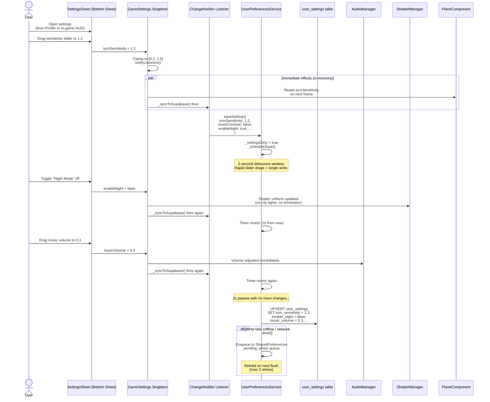
```mermaid
sequenceDiagram
    actor User
    participant SettingsSheet as SettingsSheet (Bottom Sheet)
    participant GameSettings as GameSettings Singleton
    participant Listener as ChangeNotifier Listener
    participant UserPrefsService as UserPreferencesService
    participant SettingsDB as user_settings table
    participant AudioManager
    participant ShaderManager
    participant PlaneComponent

    User->>SettingsSheet: Open settings<br/>(from Profile or in-game HUD)

    User->>SettingsSheet: Drag sensitivity slider to 1.2

    SettingsSheet->>GameSettings: turnSensitivity = 1.2

    GameSettings->>GameSettings: Clamp to [0.2, 1.5]<br/>notifyListeners()

    par Immediate effects (in-memory)
        GameSettings->>PlaneComponent: Reads turnSensitivity<br/>on next frame
        GameSettings->>Listener: _syncToSupabase() fires
    end

    Listener->>UserPrefsService: saveSettings(<br/>  turnSensitivity: 1.2,<br/>  invertControls: false,<br/>  enableNight: true, ...<br/>)

    UserPrefsService->>UserPrefsService: _settingsDirty = true<br/>_scheduleSave()

    Note over UserPrefsService: 2-second debounce window.<br/>Rapid slider drags = single write.

    User->>SettingsSheet: Toggle "Night Mode" off
    SettingsSheet->>GameSettings: enableNight = false
    GameSettings->>ShaderManager: Shader uniform updated<br/>(no city lights, no terminator)
    GameSettings->>Listener: _syncToSupabase() fires again
    UserPrefsService->>UserPrefsService: Timer resets (2s from now)

    User->>SettingsSheet: Drag music volume to 0.3
    SettingsSheet->>GameSettings: musicVolume = 0.3
    GameSettings->>AudioManager: Volume adjusted immediately
    GameSettings->>Listener: _syncToSupabase() fires again
    UserPrefsService->>UserPrefsService: Timer resets again

    Note over UserPrefsService: 2s passes with no more changes...

    UserPrefsService->>SettingsDB: UPSERT user_settings<br/>SET turn_sensitivity = 1.2,<br/>enable_night = false,<br/>music_volume = 0.3, ...

    alt Write fails (offline / network error)
        UserPrefsService->>UserPrefsService: Enqueue to SharedPreferences<br/>pending_writes queue
        Note over UserPrefsService: Retried on next flush<br/>(max 3 retries)
    end
```

**Hydration guard**: On login, `hydrateFrom()` sets `_hydrating = true` to suppress `_syncToSupabase()` while populating fields from the database — preventing a circular write-back of the values just loaded.

---

## State Residence Summary

| Data | In-Memory Location | Persistent Location | Write Strategy |
|------|-------------------|---------------------|----------------|
| Auth session (JWT) | Supabase SDK | Platform secure storage | Automatic (SDK) |
| Player stats (level, xp, coins) | `AccountState` via Riverpod | `profiles` table | Debounced 2s upsert |
| Game settings | `GameSettings` singleton | `user_settings` table | Debounced 2s upsert |
| Avatar config | `AccountState.avatar` | `account_state.avatar_config` (JSONB) | Debounced 2s upsert |
| Owned cosmetics | `AccountState.ownedCosmetics` | `account_state.owned_cosmetics` (text[]) | Debounced 2s upsert |
| Equipped items | `AccountState.equippedPlaneId` etc. | `account_state.equipped_*` | Debounced 2s upsert |
| Daily streak | `AccountState.dailyStreakData` | `account_state.daily_streak_data` (JSONB) | Debounced 2s upsert |
| Last daily result | `AccountState.lastDailyResult` | `account_state.last_daily_result` (JSONB) | Debounced 2s upsert |
| Game scores | Transient (PlayScreen) | `scores` table | Immediate INSERT |
| Active game session | `GameSession` (local) | Nowhere (ephemeral) | Not persisted |
| Challenges | Fetched on demand | `challenges` table | Immediate INSERT/UPDATE |
| Friend list | Fetched on demand | `friendships` table | Immediate INSERT/UPDATE |
| Matchmaking entry | Fetched on demand | `matchmaking_pool` table | Immediate INSERT |
| Failed writes | — | `SharedPreferences` (pending_writes) | Retry on next flush |
| Error telemetry | — | Vercel in-memory + GitHub JSONL | POST on capture |

---

## Known Persistence Risks & Data Loss Scenarios

The debounced-write architecture is efficient but introduces windows where data exists only in memory. This section maps every scenario where player data can be lost, and which mitigations exist (or are still missing).

### Risk Matrix

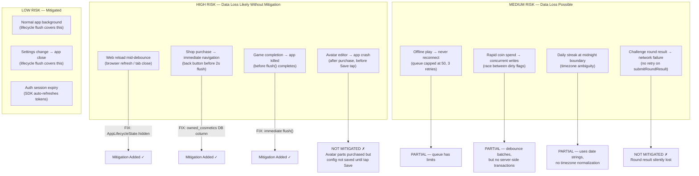
```mermaid
flowchart TD
    subgraph "HIGH RISK — Data Loss Likely Without Mitigation"
        R1["Web reload mid-debounce<br/>(browser refresh / tab close)"]
        R2["Shop purchase → immediate navigation<br/>(back button before 2s flush)"]
        R3["Game completion → app killed<br/>(before flush() completes)"]
        R4["Avatar editor → app crash<br/>(after purchase, before Save tap)"]
    end

    subgraph "MEDIUM RISK — Data Loss Possible"
        R5["Offline play → never reconnect<br/>(queue capped at 50, 3 retries)"]
        R6["Rapid coin spend → concurrent writes<br/>(race between dirty flags)"]
        R7["Daily streak at midnight boundary<br/>(timezone ambiguity)"]
        R8["Challenge round result → network failure<br/>(no retry on submitRoundResult)"]
    end

    subgraph "LOW RISK — Mitigated"
        R9["Normal app background<br/>(lifecycle flush covers this)"]
        R10["Settings change → app close<br/>(lifecycle flush covers this)"]
        R11["Auth session expiry<br/>(SDK auto-refreshes tokens)"]
    end

    R1 -->|"FIX: AppLifecycleState.hidden"| M1["Mitigation Added ✓"]
    R2 -->|"FIX: owned_cosmetics DB column"| M2["Mitigation Added ✓"]
    R3 -->|"FIX: immediate flush()"| M3["Mitigation Added ✓"]
    R4 --> M4["NOT MITIGATED ✗<br/>Avatar parts purchased but<br/>config not saved until tap Save"]
    R5 --> M5["PARTIAL — queue has limits"]
    R6 --> M6["PARTIAL — debounce batches,<br/>but no server-side transactions"]
    R7 --> M7["PARTIAL — uses date strings,<br/>no timezone normalization"]
    R8 --> M8["NOT MITIGATED ✗<br/>Round result silently lost"]
```

### Detailed Breakdown by Flow

#### On Web Reload / Tab Close

| Scenario | What's at risk | Mitigation | Status |
|----------|---------------|------------|--------|
| User refreshes browser during 2s debounce | Any dirty `profiles`, `user_settings`, or `account_state` data | `AppLifecycleState.hidden` triggers immediate `flush()` | **Fixed** (`main.dart`) |
| User closes tab (not refresh) | Same as above | `hidden` fires before `detached` on most browsers | **Fixed** but browser-dependent |
| iOS Safari PWA swipe-away | App killed without lifecycle events | `sendBeacon()` fallback for error telemetry only — **no** equivalent for game state | **Not mitigated** |
| `SharedPreferences` offline queue on web | Stored in `localStorage` — survives reload | Queue drains on next `flush()` after re-login | **Works** |

#### On Shop Purchase

| Scenario | What's at risk | Mitigation | Status |
|----------|---------------|------------|--------|
| Buy item → immediately navigate away | `owned_cosmetics` set only in Riverpod memory, not yet flushed to DB | `owned_cosmetics` column added to `account_state`; purchase calls `saveAccountState()` | **Fixed** (`account_provider.dart`, `20260221_owned_cosmetics.sql`) |
| Buy item → app crash before 2s debounce | Coins deducted in memory but not written; cosmetic ownership not written | Both are dirty-flagged, but crash kills the timer | **Partially mitigated** — coin deduction and ownership are in the same flush, so they're atomic *when the flush runs* |
| Buy item → Supabase write fails | Coins + ownership queued in offline write queue | Retried up to 3 times on next flush | **Mitigated** |
| Equip item → navigate away | `equipped_plane_id` only in Riverpod until debounce flush | Covered by lifecycle flush on navigate/background | **Mitigated** |

#### On Game Completion

| Scenario | What's at risk | Mitigation | Status |
|----------|---------------|------------|--------|
| Game ends → `recordGameCompletion()` | Score INSERT + profile UPSERT | `flush()` called immediately (no debounce) | **Fixed** (`account_provider.dart`) |
| Game ends → app killed before flush completes | Score row not inserted; coins/XP not updated | `flush()` is async — if killed mid-flight, data lost | **Risk remains** (no `sendBeacon` equivalent for Supabase writes) |
| Daily challenge → onComplete callback | Streak + daily result saved to `account_state` | Debounced 2s — **not** immediate | **Risk** — fast app close after "Done" could lose streak |

#### On Avatar Save

| Scenario | What's at risk | Mitigation | Status |
|----------|---------------|------------|--------|
| Purchase part → don't tap Save → navigate away | Coins spent (will flush), but avatar config reverted to previous | Part ownership is saved; avatar config is not | **By design** — but user may not understand coins were spent for a part they "lost" |
| Tap Save → app crash before debounce | Avatar config in memory, not yet written | Lifecycle flush covers normal app background; crash = loss | **Partially mitigated** |

#### On Daily Challenge Streak

| Scenario | What's at risk | Mitigation | Status |
|----------|---------------|------------|--------|
| Complete daily at 23:59 → streak date = today, but server sees tomorrow (UTC) | Streak may not increment or may double-count | Dates stored as `YYYY-MM-DD` strings with no timezone normalization | **Not mitigated** — no UTC enforcement |
| Complete daily → close app before `saveAccountState` flushes | `daily_streak_data` JSONB not written | Debounced 2s, covered by lifecycle flush only | **Partially mitigated** |

#### On Challenge Round Submission

| Scenario | What's at risk | Mitigation | Status |
|----------|---------------|------------|--------|
| `submitRoundResult()` network failure | Round time/score not recorded in `challenges.rounds` JSONB | No retry mechanism — error caught and logged, but round result silently lost | **Not mitigated** |
| Both players finish but `tryCompleteChallenge()` fails | Challenge stuck in `in_progress` forever | No expiry cron or cleanup job | **Not mitigated** |

### Persistence Gap Diagram

Shows what happens at each stage if the app is killed:

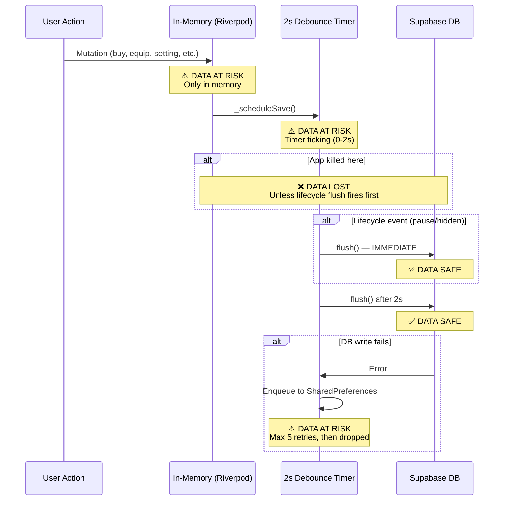
```mermaid
sequenceDiagram
    participant Action as User Action
    participant Memory as In-Memory (Riverpod)
    participant Timer as 2s Debounce Timer
    participant DB as Supabase DB

    Action->>Memory: Mutation (buy, equip, setting, etc.)
    Note over Memory: ⚠ DATA AT RISK<br/>Only in memory

    Memory->>Timer: _scheduleSave()
    Note over Timer: ⚠ DATA AT RISK<br/>Timer ticking (0-2s)

    alt App killed here
        Note over Memory,DB: ❌ DATA LOST<br/>Unless lifecycle flush fires first
    end

    alt Lifecycle event (pause/hidden)
        Timer->>DB: flush() — IMMEDIATE
        Note over DB: ✅ DATA SAFE
    end

    Timer->>DB: flush() after 2s
    Note over DB: ✅ DATA SAFE

    alt DB write fails
        DB->>Timer: Error
        Timer->>Timer: Enqueue to SharedPreferences
        Note over Timer: ⚠ DATA AT RISK<br/>Max 5 retries, then dropped
    end
```

### Resolved Persistence Bugs (2026-02-24 Audit — All Fixed)

Bugs 1-4 were identified on 2026-02-24 and have been fixed. Retained here for reference.

#### BUG 1 — ~~CRITICAL~~ FIXED: Flush `.then()` Race Condition

**Status:** FIXED via write-version counters (`_profileWriteVersion`, `_settingsWriteVersion`, `_accountStateWriteVersion` at `user_preferences_service.dart:226-228`). Each `.then()` callback checks version hasn't changed before clearing dirty flags.

---

#### BUG 2 — ~~HIGH~~ FIXED: Abort Path Daily Callback Ordering

**Status:** FIXED — `play_screen.dart:1110-1141` now fires daily callbacks BEFORE `recordGameCompletion()` in the abort path, matching the normal `_completeLanding()` ordering.

---

#### BUG 3 — ~~HIGH~~ FIXED: Flush Mutex

**Status:** FIXED via `Completer<void>? _flushLock` at `user_preferences_service.dart:252`. Concurrent `flush()` callers now await the in-flight flush, then re-check dirty flags before starting a new one.

---

#### BUG 4 — ~~MEDIUM~~ FIXED: Crash-Safe Cache Stale Overwrite

**Status:** FIXED by BUG 1's write-version counters. `.then()` callbacks only clear the local cache when the version hasn't changed since flush start, so newer crash-safe data is never deleted.

---

#### BUG 5 — ~~LOW~~ FIXED: Flow 8 Callback Ordering Documentation

**Status:** FIXED — Flow 8 diagram updated to show callbacks firing BEFORE `recordGameCompletion()`, matching the actual code in `_completeLanding()`. Abort path (BUG 2) also fixed to match.

---

### Active Persistence Bugs (2026-02-25 Audit)

New bugs identified on 2026-02-25. These are the likely remaining causes of stat/coin resets.

#### BUG 6 — HIGH: Purchase Double-Deduction (Client + Server Both Deduct Coins)

**Files:** `account_provider.dart:791-848`, `rebuild.sql:686` (`purchase_cosmetic` RPC)

**The problem:** When a player buys a cosmetic, two independent coin deductions occur:
1. **Client-side:** `purchaseCosmetic()` calls `spendCoins(price)` → `_syncProfile()` → debounced upsert with `coins = oldCoins - price`
2. **Server-side:** `_serverValidatePurchase()` fires `purchase_cosmetic` RPC which atomically does `UPDATE profiles SET coins = coins - cost`

If the debounced upsert fires BEFORE the RPC reads the row, the RPC sees already-deducted coins and deducts again. The RPC returns `new_balance` and the client reconciles to it, but only for the local `Player` object — `_syncProfile()` is NOT called after reconciliation, so the next debounce cycle may write the stale higher value back.

**Reproduction:**
```
1. Player has 500 coins, buys item costing 100
2. spendCoins(100) → local coins = 400, _syncProfile() marks dirty
3. Debounce fires within 2s → UPSERT profiles SET coins = 400 ✓
4. _serverValidatePurchase() RPC → server reads coins=400, deducts 100 → coins=300
5. RPC returns new_balance=300 → client sets _player.coins = 300
6. But no _syncProfile() after reconciliation → dirty flag not set
7. Next mutation triggers _syncProfile() with stale pending payload → could write coins=400 again
```

**Net effect:** Player loses 200 coins instead of 100, OR coins oscillate between values.

**Fix:** Remove client-side `spendCoins()` from the purchase path entirely. Let the RPC be the sole deduction, reconcile from `new_balance`, then call `_syncProfile()` to persist the reconciled value.

---

#### BUG 7 — HIGH: sendCoins Ignores Server Balance Return

**Files:** `friends_screen.dart:653-665`, `friends_service.dart` (`sendCoins` RPC), `rebuild.sql:1141`

**The problem:** When sending coins to a friend:
1. `sendCoins` RPC atomically transfers coins and returns `sender_balance`
2. `friends_screen.dart` calls the RPC but only checks the boolean success flag
3. Then calls `accountNotifier.spendCoins(amount)` — a second, independent deduction on the client

Same pattern as BUG 6: double-deduction where client `spendCoins()` and server RPC both subtract.

**Fix:** Remove `spendCoins()` call after `sendCoins` RPC. Instead, read the returned `sender_balance` and set coins directly, then call `_syncProfile()`.

---

#### BUG 8 — MEDIUM: _recoverLocalCache Has No account_state Monotonic Protection

**File:** `user_preferences_service.dart:731-804` (`_recoverLocalCache()`)

**The problem:** The crash-safe recovery merge (`{...serverData, ...localData}`) applies monotonic max() protection for `_kLocalProfile` keys (xp, total_score, games_played, etc.), but does NOT apply any protection for `_kLocalAccountState`. A stale local cache can overwrite newer server `account_state` values (daily streak, equipped items, owned cosmetics).

**Risk scenario:** Player completes daily challenge on Device B (server updated), then opens Device A which has a stale `account_state` cache from before the challenge. The stale cache overwrites the server's newer daily streak data.

**Fix:** Either add monotonic merge for account_state fields that should never regress (daily streak count, owned items sets), or skip local cache recovery for account_state entirely (it's less latency-critical than profile stats).

---

#### BUG 9 — LOW: _applySnapshot Unconditional account_state Overwrite

**File:** `account_provider.dart:245` (`_applySnapshot()`)

**The problem:** `_applySnapshot()` uses `math.max()` merge for profile stats (xp, score, games_played), but overwrites `account_state` unconditionally from the server snapshot. If the server snapshot is stale (e.g., from a failed write), equipped items or daily streak could regress.

**Mitigated by:** The `hasPendingWrites` guard in `refreshFromServer()` prevents snapshots from being applied when local writes are pending. Risk is LOW because `_applySnapshot()` is only called after a fresh server read.

---

#### BUG 10 — HIGH: Crash-Safe Cache Coin Duplication

**File:** `user_preferences_service.dart:761-795` (`_recoverLocalCache()`)

**The problem:** Coins are excluded from monotonic protection (intentionally — they're consumable). But the crash-safe cache merge `{...serverData, ...localData}` means:
1. Player has 500 coins, earns 100 → local cache writes 600
2. Flush succeeds → server has 600, local cache cleared
3. Player spends 50 → local cache writes 550
4. App crashes before flush
5. Next session: server has 600, local cache has 550
6. Merge: `{server: 600, local: 550}` → local wins → coins = 550 ✓ (correct here)

**But this scenario duplicates coins:**
1. Player has 500 coins, earns 100 → local cache writes 600
2. Flush FAILS → server still has 500, local cache has 600
3. App crashes
4. Next session: server has 500, local cache has 600
5. Merge: local wins → coins = 600
6. Player now has 600 coins locally, but only earned 100. Server later gets UPSERT with 600. Correct.
7. BUT if between crash and restart, another device wrote coins=500 to server (no change), the merge is still correct.

**The real risk:** If `_recoverLocalCache` runs AFTER `_applySnapshot` from server, the local cache value overwrites the max()-merged profile. Since coins have no max() protection, a stale local cache can set coins higher than the server value, effectively duplicating coins that were spent on another device.

**Fix:** For coins specifically, use server value as authoritative and only apply local cache delta (local - lastFlushedLocal) rather than absolute override.

---

#### BUG 11 — HIGH: Backfill Script Destructive Without GREATEST()

**File:** `supabase/backfill_profile_stats_from_scores.sql`

**The problem:** The backfill script uses `UPDATE profiles SET total_score = computed, games_played = computed, ...` without `GREATEST(profiles.total_score, computed)`. If the computed values from the `scores` table are lower than the current profile values (e.g., some scores were deleted or the player earned stats through non-score paths), the script would REGRESS stats.

**Note:** The `protect_profile_stats` DB trigger uses `GREATEST()` and would catch this on UPDATE. But if the script is run with `SET LOCAL app.skip_stat_protection = 'true'` (as admin scripts sometimes do), the trigger is bypassed and stats are destroyed.

**Fix:** Add `GREATEST(profiles.column, computed_value)` to all SET clauses in the backfill script, OR remove the `skip_stat_protection` bypass from the script.

---

#### BUG 12 — LOW: Admin Rename Fails Silently Due to RLS

**File:** `rebuild.sql` (RLS policies on `profiles` table)

**The problem:** The `admin_rename_player` function runs as `SECURITY DEFINER` but the calling context still has the user's RLS context. If the admin function tries to update another player's profile, RLS may block it silently (returning 0 rows affected rather than an error).

**Fix:** Ensure admin functions either use `SECURITY DEFINER` with explicit `SET search_path` and bypass RLS, or check `rows_affected` and raise an exception on 0.

---

### Previously Identified Gaps (All Fixed)

| # | Gap | Fix Applied | Files Changed |
|---|-----|-------------|---------------|
| 1 | **iOS Safari PWA kill** — no lifecycle event fires | Added `beforeunload` web event handler via `WebFlushBridge` that triggers `UserPreferencesService.flush()` + `ErrorService.flush()` before page unload | `web_flush_bridge.dart`, `web_flush_bridge_web.dart`, `web_flush_bridge_stub.dart`, `main.dart` |
| 2 | **Challenge round result has no retry** | Added exponential backoff retry (1s, 2s, 4s) up to 3 retries on both `submitRoundResult()` and `tryCompleteChallenge()` | `challenge_service.dart` |
| 3 | **Stale challenges never expire** | Added `expire_stale_challenges()` SQL function that marks pending/in_progress challenges older than 7 days as expired; called automatically by Vercel health cron every 3 days | `20260221_expire_stale_challenges.sql`, `api/health/index.js` |
| 4 | **Daily streak timezone ambiguity** | Changed `AccountState._todayStr()` from `DateTime.now()` to `DateTime.now().toUtc()`, matching `DailyStreak` model which already uses UTC | `account_provider.dart` |
| 5 | **Avatar part purchase without Save** | Auto-save avatar config immediately after purchasing a part in the editor (calls `updateAvatar()` right after `purchaseAvatarPart()`) | `avatar_editor_screen.dart` |
| 6 | **Offline queue hard limits** | Increased queue from 50→200 entries and 3→5 retries; added `SyncStatusIndicator` widget in profile AppBar that shows pending offline write count | `user_preferences_service.dart`, `sync_status_indicator.dart`, `profile_screen.dart` |
| 7 | **No server-side coin validation** | Added `purchase_cosmetic()` SQL function with row-level locking, balance check, duplicate detection, and atomic coin deduction; `purchaseCosmetic()` now fires server-side RPC validation after optimistic client-side update | `20260221_purchase_cosmetic_function.sql`, `account_provider.dart` |

---

## Flush Trigger Map

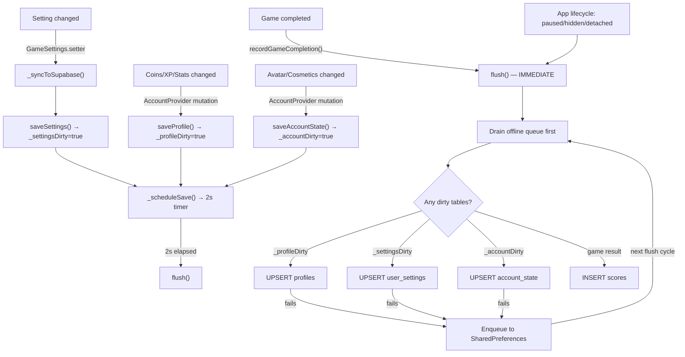
```mermaid
flowchart TD
    A["Setting changed"] -->|"GameSettings.setter"| B["_syncToSupabase()"]
    B --> C["saveSettings() → _settingsDirty=true"]
    C --> D["_scheduleSave() → 2s timer"]

    E["Coins/XP/Stats changed"] -->|"AccountProvider mutation"| F["saveProfile() → _profileDirty=true"]
    F --> D

    G["Avatar/Cosmetics changed"] -->|"AccountProvider mutation"| H["saveAccountState() → _accountDirty=true"]
    H --> D

    D -->|"2s elapsed"| I["flush()"]

    J["Game completed"] -->|"recordGameCompletion()"| K["flush() — IMMEDIATE"]
    L["App lifecycle: paused/hidden/detached"] --> K

    K --> M["Drain offline queue first"]
    M --> N{"Any dirty tables?"}
    N -->|"_profileDirty"| O["UPSERT profiles"]
    N -->|"_settingsDirty"| P["UPSERT user_settings"]
    N -->|"_accountDirty"| Q["UPSERT account_state"]
    N -->|"game result"| R["INSERT scores"]

    O -->|"fails"| S["Enqueue to SharedPreferences"]
    P -->|"fails"| S
    Q -->|"fails"| S
    S -->|"next flush cycle"| M
```

---

## Vercel Serverless Endpoints

| Endpoint | Method | Auth | Purpose |
|----------|--------|------|---------|
| `/api/errors` | POST | None (open) | Receive error reports from Flutter app |
| `/api/errors` | GET | X-API-Key header | Query stored errors (severity, since, limit) |
| `/api/health` | GET | None | Health check + Supabase keep-alive ping |

The health endpoint is hit by a Vercel cron every 3 days to prevent Supabase's free-tier auto-pause (7-day inactivity timeout).

---

## Key File Reference

| Component | File |
|-----------|------|
| App entry + lifecycle flush | `lib/main.dart` |
| Supabase config | `lib/core/config/supabase_config.dart` |
| Auth service | `lib/data/services/auth_service.dart` |
| Account provider (Riverpod) | `lib/data/providers/account_provider.dart` |
| Persistence service | `lib/data/services/user_preferences_service.dart` |
| Game settings singleton | `lib/core/services/game_settings.dart` |
| Settings UI | `lib/core/widgets/settings_sheet.dart` |
| Login screen | `lib/features/auth/login_screen.dart` |
| Profile screen | `lib/features/profile/profile_screen.dart` |
| Play screen (game) | `lib/features/play/play_screen.dart` |
| Daily challenge screen | `lib/features/daily/daily_challenge_screen.dart` |
| Shop screen | `lib/features/shop/shop_screen.dart` |
| Avatar editor | `lib/features/avatar/avatar_editor_screen.dart` |
| Leaderboard service | `lib/data/services/leaderboard_service.dart` |
| Challenge service | `lib/data/services/challenge_service.dart` |
| Matchmaking service | `lib/data/services/matchmaking_service.dart` |
| Friends service | `lib/data/services/friends_service.dart` |
| Error telemetry API | `api/errors/index.js` |
| Health check API | `api/health/index.js` |
| SQL migrations | `supabase/migrations/*.sql` |

---

## Complete Database Interaction Trace (2026-02-24 Audit)

Every Supabase read/write traced through the full game lifecycle. Use this to diagnose persistence issues.

### Write Operations — When Data is Sent to Supabase

| # | Trigger | Table | Operation | Write Strategy | Flush Guarantee | File:Line |
|---|---------|-------|-----------|----------------|-----------------|-----------|
| W1 | Game completion (normal) | `profiles` | UPSERT | Debounced → **immediate flush** | Explicit `flush()` at end of `recordGameCompletion()` | `account_provider.dart:748` |
| W2 | Game completion (normal) | `account_state` | UPSERT | Debounced → **immediate flush** | Daily callbacks fire BEFORE flush, included in same cycle | `account_provider.dart:748` |
| W3 | Game completion (normal) | `scores` | INSERT | Immediate | `saveGameResult()` awaited inline | `account_provider.dart:737` |
| W4 | Game completion (normal) | `coin_activity` | INSERT | Fire-and-forget | Best effort, queued on failure | `account_provider.dart:524` |
| W5 | **Game abort** | `profiles` | UPSERT | Debounced → **immediate flush** | Flush inside `recordGameCompletion()` | `play_screen.dart:1113` |
| W6 | **Game abort** | `account_state` | UPSERT | Debounced → **immediate flush** | Daily callbacks now fire BEFORE flush (BUG 2 FIXED) | `play_screen.dart:1110-1161` |
| W7 | **Game abort** | `scores` | INSERT | Immediate | Same as W3 | `play_screen.dart:1113` |
| W8 | Setting changed | `user_settings` | UPSERT | Debounced 2s | Lifecycle flush on app pause/hide | `game_settings.dart:56-68` |
| W9 | Setting changed (local) | SharedPreferences | SET | Immediate | `_saveToLocal()` awaited | `game_settings.dart:112-131` |
| W10 | Avatar saved | `account_state` | UPSERT | Debounced → **immediate flush** | `updateAvatar()` calls `flush()` | `account_provider.dart:758` |
| W11 | Shop purchase (coins) | `profiles` | UPSERT | Debounced 2s | Lifecycle flush only | `account_provider.dart:546` |
| W12 | Shop purchase (ownership) | `account_state` | UPSERT | Debounced 2s | Lifecycle flush only | `account_provider.dart:796` |
| W13 | Shop purchase (server RPC) | `profiles` + `account_state` | RPC | Immediate fire-and-forget | Server-side atomic, but client-side already applied optimistically | `account_provider.dart:806-848` |
| W14 | Region unlock | `profiles` + `account_state` | UPSERT | Debounced 2s | Lifecycle flush only | `account_provider.dart:567-572` |
| W15 | License reroll | `account_state` | UPSERT | Debounced 2s | Lifecycle flush only | `account_provider.dart:993` |
| W16 | Free reroll | `account_state` | UPSERT | Debounced 2s | Lifecycle flush only | `account_provider.dart:1026` |
| W17 | Daily scramble reroll | `account_state` | UPSERT | Debounced 2s | Lifecycle flush only | `account_provider.dart:1130` |
| W18 | Equip plane/contrail/companion | `account_state` | UPSERT | Debounced 2s | Lifecycle flush only | `account_provider.dart:914-933` |
| W19 | Equip/clear title | `account_state` | UPSERT | Debounced 2s | Lifecycle flush only | `account_provider.dart:943-951` |
| W20 | Update nationality | `account_state` | UPSERT | Debounced 2s | Lifecycle flush only | `account_provider.dart:966` |
| W21 | Streak recovery | `account_state` | UPSERT | Debounced 2s | Lifecycle flush only | `account_provider.dart:1095` |
| W22 | Profile edit (username) | `profiles` | UPSERT | Debounced 2s | Lifecycle flush only | `account_provider.dart:447` |
| W23 | Challenge round result | `challenges` | UPDATE | Immediate with retry | 3 retries with backoff | `challenge_service.dart` |
| W24 | Challenge completion | `challenges` | UPDATE | Immediate with retry | 3 retries with backoff | `challenge_service.dart` |
| W25 | Matchmaking queue | `matchmaking_pool` | INSERT | Immediate | Awaited inline | `matchmaking_service.dart` |
| W26 | Friend request | `friendships` | INSERT | Immediate | Awaited inline | `friends_service.dart` |
| W27 | App lifecycle (pause/hidden/detached) | All dirty tables | UPSERT | **Immediate flush** | `flush()` from `didChangeAppLifecycleState` | `main.dart:257-262` |
| W28 | Web beforeunload | All dirty tables | UPSERT | **Immediate flush** | `WebFlushBridge` handler | `main.dart:78-83` |
| W29 | Periodic refresh (5min) | All dirty tables | UPSERT | Flush before refresh | Only if `hasPendingWrites` detected | `account_provider.dart:383` |
| W30 | Offline queue retry | Various | INSERT/UPSERT | Oldest-first, sequential | On every `_flush()` call | `user_preferences_service.dart:550-609` |

### Read Operations — When Data is Fetched from Supabase

| # | Trigger | Tables | Strategy | File:Line |
|---|---------|--------|----------|-----------|
| R1 | Login (existing session) | `profiles` | Single SELECT | `auth_service.dart:75` |
| R2 | Login (sign in/up) | `profiles` | SELECT or INSERT | `auth_service.dart:348-434` |
| R3 | `loadFromSupabase()` | `profiles` + `user_settings` + `account_state` | 3 parallel SELECTs | `user_preferences_service.dart:267-279` |
| R4 | Crash-safe recovery | SharedPreferences | Merge local over server | `user_preferences_service.dart:294-311` |
| R5 | Periodic refresh (5min) | `profiles` + `user_settings` + `account_state` | 3 parallel SELECTs | `account_provider.dart:393` |
| R6 | Leaderboard (global) | `leaderboard_global` view | Cached 30s TTL | `leaderboard_service.dart` |
| R7 | Leaderboard (daily) | `leaderboard_daily` view | Cached 30s TTL | `leaderboard_service.dart` |
| R8 | Leaderboard (friends) | `friendships` + `leaderboard_global` | Cached 30s TTL | `leaderboard_service.dart` |
| R9 | Game history | `scores` | On-demand, cached 30s | `leaderboard_service.dart` |
| R10 | Challenge list | `challenges` | On-demand | `challenge_service.dart` |
| R11 | Friends list | `friendships` | On-demand | `friends_service.dart` |
| R12 | Data export | All user tables | Parallel fetch (one-time) | `account_management_service.dart` |

### Crash-Safe Local Cache Operations (SharedPreferences)

| Key | Written By | Read By | Cleared By | Purpose |
|-----|-----------|---------|------------|---------|
| `crash_safe_profile` | `saveProfile()` via `_cacheLocally()` | `load()` via `_recoverLocalCache()` | `_flush().then()` on success, `clear()` on sign-out | Profile data surviving force-close |
| `crash_safe_settings` | `saveSettings()` via `_cacheLocally()` | `load()` via `_recoverLocalCache()` | `_flush().then()` on success, `clear()` on sign-out | Settings data surviving force-close |
| `crash_safe_account_state` | `saveAccountState()` via `_cacheLocally()` | `load()` via `_recoverLocalCache()` | `_flush().then()` on success, `clear()` on sign-out | Account state surviving force-close |
| `pending_writes` | `_PendingWriteQueue.enqueue()` on flush failure | `retryPendingWrites()` on next flush | `dequeue()` on success, `clear()` on sign-out | Offline write queue (max 200, 5 retries) |
| `game_settings` | `GameSettings._saveToLocal()` on every change | `GameSettings.loadFromLocal()` on app start | Never (overwritten on each change) | Settings cache for instant hydration |

### Data Protection Mechanisms

| Mechanism | What It Protects | Where Implemented | Limitation |
|-----------|-----------------|-------------------|------------|
| `_supabaseLoaded` guard | Prevents default `PilotLicense.random()` from being persisted before real data loads | `account_provider.dart:195,453,462` | Fragile — single boolean, no per-table granularity |
| DB trigger `protect_profile_stats` | Server-side GREATEST() for all monotonic counters on every UPDATE to profiles | `rebuild.sql:556-608` | Does NOT protect coins (consumable); bypassable via `app.skip_stat_protection` session var |
| Client monotonic stat merge | Prevents stale server data from resetting incremental counters during `_applySnapshot()` | `account_provider.dart:252-301` | Does NOT protect coins (consumable), avatar, license, cosmetics, daily streak |
| Crash-safe monotonic merge | Prevents stale local cache from regressing server stats in `_recoverLocalCache()` | `user_preferences_service.dart:761-795` | Only protects `_kLocalProfile` key; **NO** monotonic protection for `account_state` (BUG 8) |
| Write-version counters | Prevents `.then()` callback from clearing newer data written during flush | `user_preferences_service.dart:226-228` | Per-table granularity; correctly guards profile, settings, and account_state |
| Flush mutex (`_flushLock`) | Serializes concurrent flush calls | `user_preferences_service.dart:252` | Completer-based; waiters re-check dirty flags after lock release |
| `_hydrating` guard | Prevents `GameSettings.hydrateFrom()` from triggering a write-back to Supabase | `game_settings.dart:52,55,74,92,105` | Only protects settings; no equivalent for profile or account_state hydration |
| `hasPendingWrites` guard | Prevents periodic refresh from overwriting dirty local state with stale server data | `account_provider.dart:381-389` | Correct; flushes first, then re-checks before applying snapshot |
| Debounce batching | Coalesces rapid mutations into single write | `user_preferences_service.dart:806-809` | 2-second window where data exists only in memory |
| Offline write queue | Retries failed Supabase writes | `user_preferences_service.dart:29-171` | Capped at 200 entries, 5 retries; dropped after max retries |
| Crash-safe local cache | Recovers mutations from force-close | `user_preferences_service.dart:731-804` | BUG 10: coins not protected (stale local can duplicate coins); BUG 8: account_state not protected |
| Lifecycle flush | Writes dirty data when app backgrounds | `main.dart:248-263` | Unreliable on iOS Safari PWA; `hidden` may not fire on tab close |
| Web beforeunload flush | Last-chance write on web page unload | `main.dart:78-83` via `WebFlushBridge` | `beforeunload` not fired on iOS PWA swipe-away |

---

## Fix Plan — Persistence Reliability

### Completed Fixes (2026-02-24)

| Fix | Bug | Status | Implementation |
|-----|-----|--------|----------------|
| Version-Guarded Flush | BUG 1 + BUG 4 | ✅ DONE | Write-version counters at `user_preferences_service.dart:226-228` |
| Flush Mutex | BUG 3 | ✅ DONE | `Completer<void>? _flushLock` at `user_preferences_service.dart:252` |
| Abort Path Reorder | BUG 2 | ✅ DONE | Daily callbacks before `recordGameCompletion()` at `play_screen.dart:1110-1141` |
| Flow 8 Documentation | BUG 5 | ✅ DONE | ARCHITECTURE.md updated |

### Active Fix Plan (2026-02-25 Audit — Priority Order)

#### Fix A: RPC-Only Coin Deduction for Purchases (Fixes BUG 6)

**Files:** `account_provider.dart:purchaseCosmetic()`, `purchaseAvatarPart()`

**Changes:**
1. Remove `spendCoins(price)` call from `purchaseCosmetic()` — the server RPC already deducts atomically
2. After RPC returns `new_balance`, set `_player = _player.copyWith(coins: newBalance)` and call `_syncProfile()`
3. If RPC fails, do NOT deduct coins locally — show error to user
4. Same change for `purchaseAvatarPart()`

**Impact:** Eliminates double-deduction on purchases. Server becomes sole authority for coin deduction on purchases.

#### Fix B: RPC-Only Coin Deduction for sendCoins (Fixes BUG 7)

**Files:** `friends_screen.dart:653-665`, `account_provider.dart`

**Changes:**
1. Remove `spendCoins(amount)` call after `sendCoins` RPC
2. Read `sender_balance` from RPC response (already returned by server function)
3. Set local coins to `sender_balance`, call `_syncProfile()`

**Impact:** Eliminates double-deduction on friend coin transfers.

#### Fix C: Monotonic Protection for account_state Recovery (Fixes BUG 8)

**File:** `user_preferences_service.dart:_recoverLocalCache()`

**Changes:**
1. For `_kLocalAccountState` crash-safe merge, add max()-based protection for fields that should never regress:
   - `daily_streak_data.current_streak` — use max of local vs server
   - `owned_cosmetics`, `owned_planes`, `owned_companions` — use set union (never remove items)
2. Leave equipped items and nationality as local-wins (these are user-preference choices, not progression)

**Impact:** Prevents stale local cache from regressing daily streak or removing owned items.

#### Fix D: Coin Delta Recovery Instead of Absolute Override (Fixes BUG 10)

**File:** `user_preferences_service.dart:_recoverLocalCache()`

**Changes:**
1. When recovering coins from crash-safe cache, store the `lastFlushedCoins` value alongside the cached value
2. On recovery, apply `serverCoins + (cachedCoins - lastFlushedCoins)` instead of just `cachedCoins`
3. This correctly applies the unflushed delta without duplicating previously-flushed earnings

**Impact:** Prevents coin duplication from crash-safe cache while still recovering unflushed coin changes.

#### Fix E: Safe Backfill Script (Fixes BUG 11)

**File:** `supabase/backfill_profile_stats_from_scores.sql`

**Changes:**
1. Add `GREATEST(profiles.total_score, computed)` to all SET clauses
2. Remove any `SET LOCAL app.skip_stat_protection = 'true'` — let the DB trigger serve as a safety net
3. Add a dry-run mode that SELECT-only compares computed vs current values before applying

**Impact:** Backfill script can never regress stats, even if run carelessly.

#### Fix F (Optional): Diagnostic Logging for Persistence Debugging

**File:** `lib/data/services/user_preferences_service.dart`

**Changes:**
1. Add `debugPrint` at key points: dirty flag set, flush start/end, version comparison, cache write/recover/clear
2. Gate behind `kDebugMode` for zero release overhead

**Impact:** Future persistence bugs diagnosable from console output.
