# Flit Architecture — State, Persistence & Flow Reference

> How game state, settings, and stats are preserved across every user interaction.

---

## System Overview

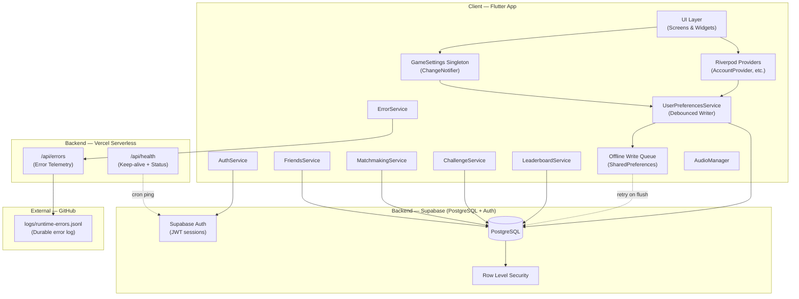

---

## Database Schema


---

## Persistence Architecture


**Immediate flush triggers** (bypass 2s debounce):
- Game completion (`recordGameCompletion`)
- App lifecycle: `paused`, `hidden`, `detached`

**Periodic refresh**: Every 5 minutes, re-fetches from Supabase (skipped if pending writes exist).

---

## Flow 1 — On Login

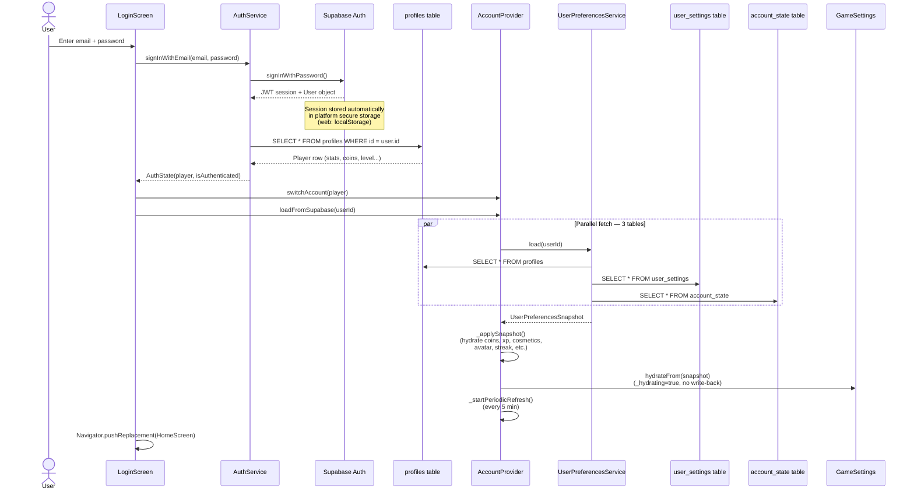

---

## Flow 2 — On Refresh (Already Logged In)

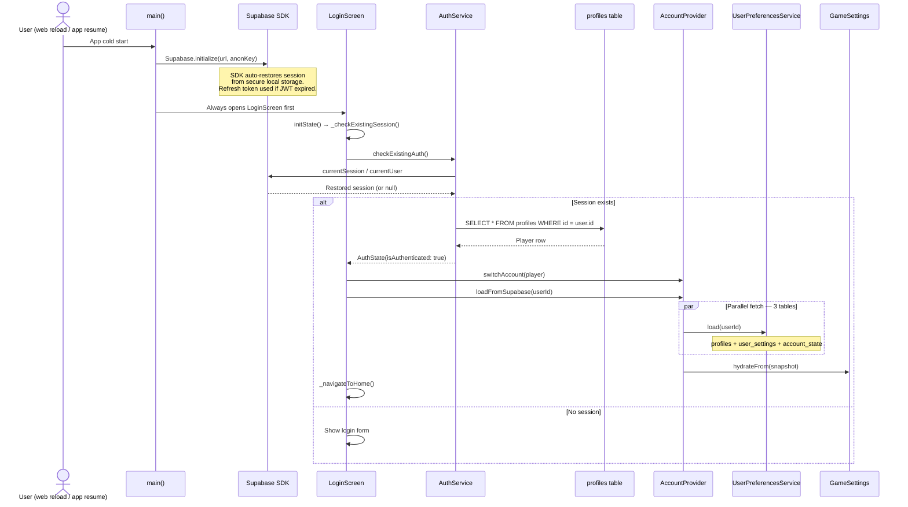

---

## Flow 3 — On Profile Page

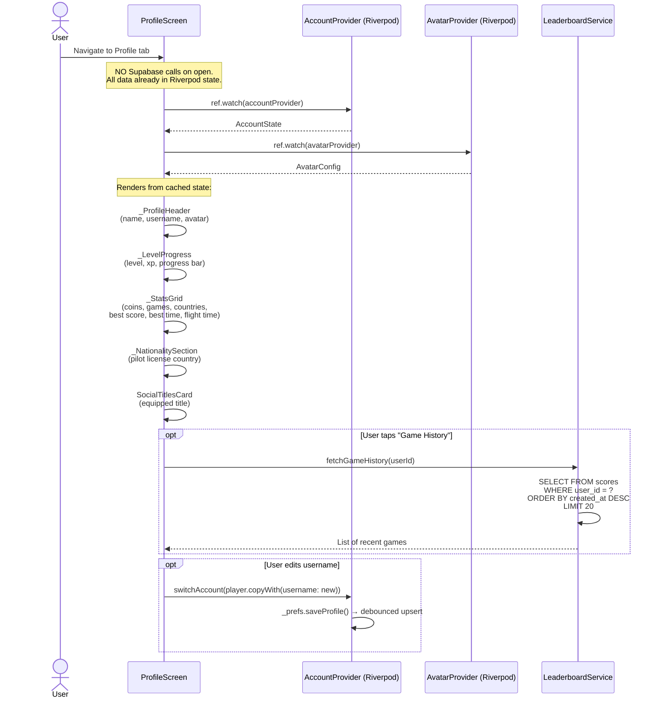

---

## Flow 4 — On Game Start

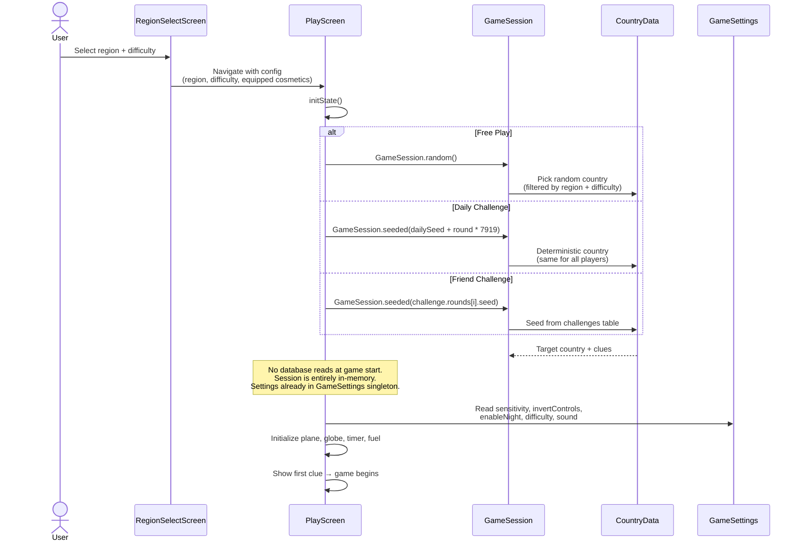

---

## Flow 5 — On Leaderboard Load

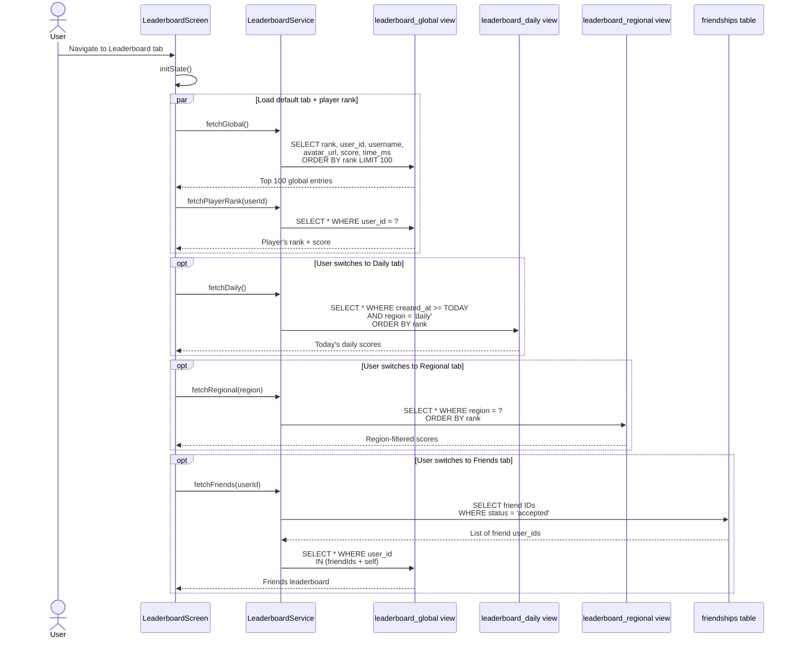

---

## Flow 6 — On Shop Purchase

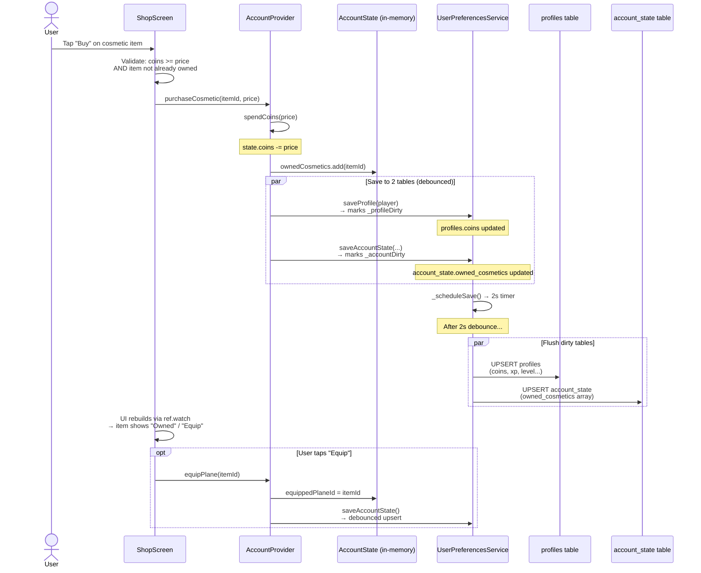

---

## Flow 7 — On Avatar Save

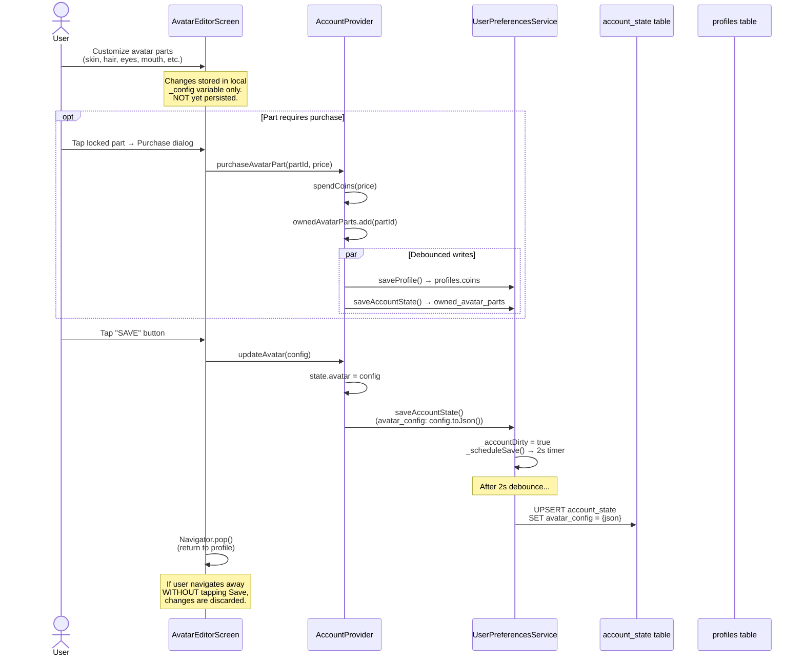

---

## Flow 8 — On Completing Daily Challenge

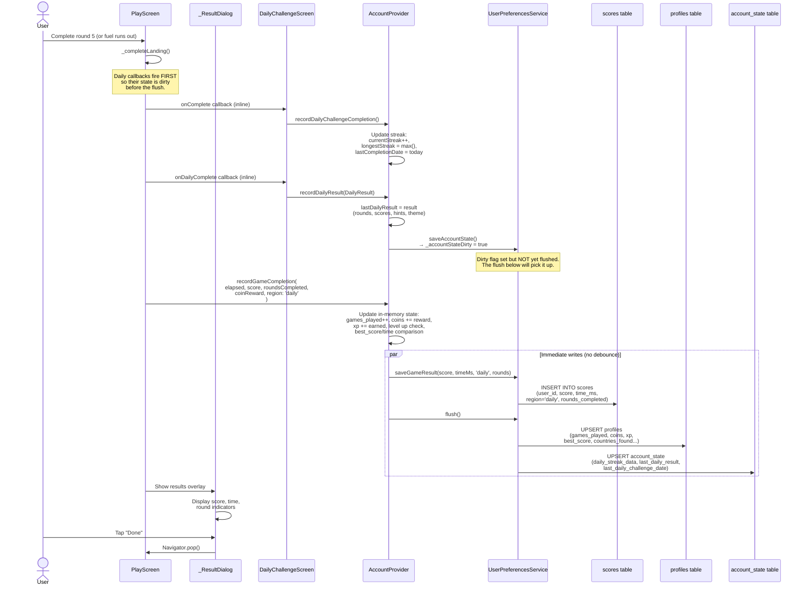

---

## Flow 9 — On Searching for Challengers (Matchmaking)

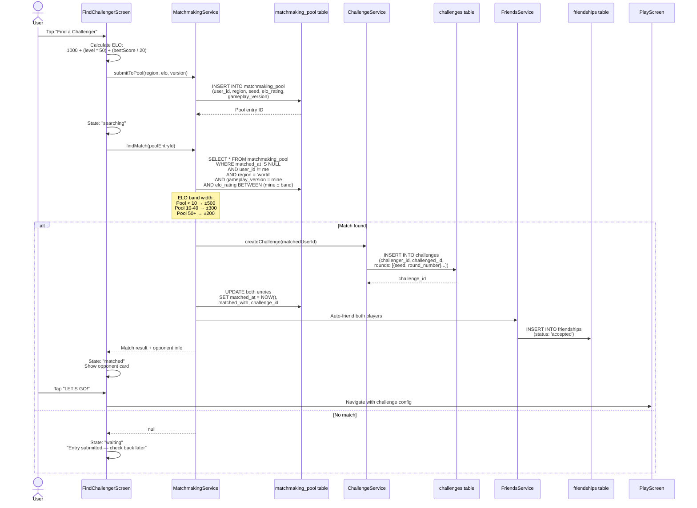

---

## Flow 10 — On Submitting a Challenge to Friend

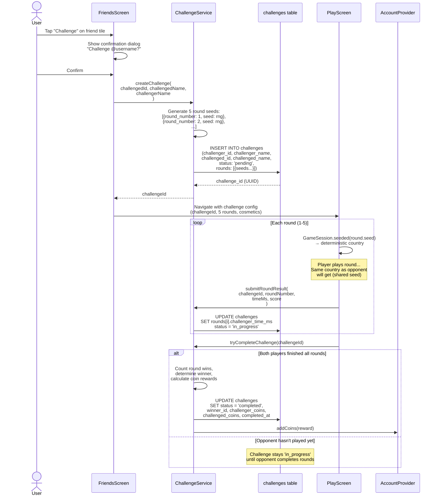

---

## Flow 11 — On Refining Game Settings

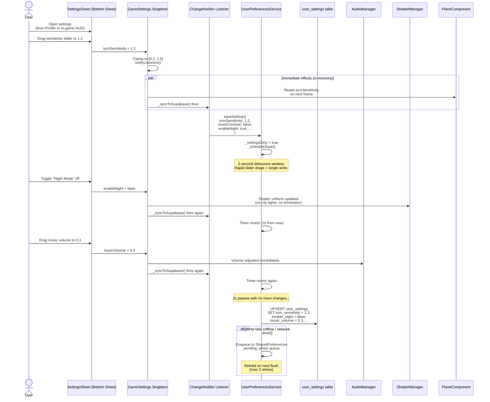

**Hydration guard**: On login, `hydrateFrom()` sets `_hydrating = true` to suppress `_syncToSupabase()` while populating fields from the database — preventing a circular write-back of the values just loaded.

---

## State Residence Summary

| Data | In-Memory Location | Persistent Location | Write Strategy |
|------|-------------------|---------------------|----------------|
| Auth session (JWT) | Supabase SDK | Platform secure storage | Automatic (SDK) |
| Player stats (level, xp, coins) | `AccountState` via Riverpod | `profiles` table | Debounced 2s upsert |
| Game settings | `GameSettings` singleton | `user_settings` table | Debounced 2s upsert |
| Avatar config | `AccountState.avatar` | `account_state.avatar_config` (JSONB) | Debounced 2s upsert |
| Owned cosmetics | `AccountState.ownedCosmetics` | `account_state.owned_cosmetics` (text[]) | Debounced 2s upsert |
| Equipped items | `AccountState.equippedPlaneId` etc. | `account_state.equipped_*` | Debounced 2s upsert |
| Daily streak | `AccountState.dailyStreakData` | `account_state.daily_streak_data` (JSONB) | Debounced 2s upsert |
| Last daily result | `AccountState.lastDailyResult` | `account_state.last_daily_result` (JSONB) | Debounced 2s upsert |
| Game scores | Transient (PlayScreen) | `scores` table | Immediate INSERT |
| Active game session | `GameSession` (local) | Nowhere (ephemeral) | Not persisted |
| Challenges | Fetched on demand | `challenges` table | Immediate INSERT/UPDATE |
| Friend list | Fetched on demand | `friendships` table | Immediate INSERT/UPDATE |
| Matchmaking entry | Fetched on demand | `matchmaking_pool` table | Immediate INSERT |
| Failed writes | — | `SharedPreferences` (pending_writes) | Retry on next flush |
| Error telemetry | — | Vercel in-memory + GitHub JSONL | POST on capture |

---

## Known Persistence Risks & Data Loss Scenarios

The debounced-write architecture is efficient but introduces windows where data exists only in memory. This section maps every scenario where player data can be lost, and which mitigations exist (or are still missing).

### Risk Matrix

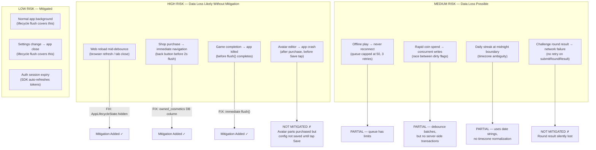

### Detailed Breakdown by Flow

#### On Web Reload / Tab Close

| Scenario | What's at risk | Mitigation | Status |
|----------|---------------|------------|--------|
| User refreshes browser during 2s debounce | Any dirty `profiles`, `user_settings`, or `account_state` data | `AppLifecycleState.hidden` triggers immediate `flush()` | **Fixed** (`main.dart`) |
| User closes tab (not refresh) | Same as above | `hidden` fires before `detached` on most browsers | **Fixed** but browser-dependent |
| iOS Safari PWA swipe-away | App killed without lifecycle events | `sendBeacon()` fallback for error telemetry only — **no** equivalent for game state | **Not mitigated** |
| `SharedPreferences` offline queue on web | Stored in `localStorage` — survives reload | Queue drains on next `flush()` after re-login | **Works** |

#### On Shop Purchase

| Scenario | What's at risk | Mitigation | Status |
|----------|---------------|------------|--------|
| Buy item → immediately navigate away | `owned_cosmetics` set only in Riverpod memory, not yet flushed to DB | `owned_cosmetics` column added to `account_state`; purchase calls `saveAccountState()` | **Fixed** (`account_provider.dart`, `20260221_owned_cosmetics.sql`) |
| Buy item → app crash before 2s debounce | Coins deducted in memory but not written; cosmetic ownership not written | Both are dirty-flagged, but crash kills the timer | **Partially mitigated** — coin deduction and ownership are in the same flush, so they're atomic *when the flush runs* |
| Buy item → Supabase write fails | Coins + ownership queued in offline write queue | Retried up to 3 times on next flush | **Mitigated** |
| Equip item → navigate away | `equipped_plane_id` only in Riverpod until debounce flush | Covered by lifecycle flush on navigate/background | **Mitigated** |

#### On Game Completion

| Scenario | What's at risk | Mitigation | Status |
|----------|---------------|------------|--------|
| Game ends → `recordGameCompletion()` | Score INSERT + profile UPSERT | `flush()` called immediately (no debounce) | **Fixed** (`account_provider.dart`) |
| Game ends → app killed before flush completes | Score row not inserted; coins/XP not updated | `flush()` is async — if killed mid-flight, data lost | **Risk remains** (no `sendBeacon` equivalent for Supabase writes) |
| Daily challenge → onComplete callback | Streak + daily result saved to `account_state` | Debounced 2s — **not** immediate | **Risk** — fast app close after "Done" could lose streak |

#### On Avatar Save

| Scenario | What's at risk | Mitigation | Status |
|----------|---------------|------------|--------|
| Purchase part → don't tap Save → navigate away | Coins spent (will flush), but avatar config reverted to previous | Part ownership is saved; avatar config is not | **By design** — but user may not understand coins were spent for a part they "lost" |
| Tap Save → app crash before debounce | Avatar config in memory, not yet written | Lifecycle flush covers normal app background; crash = loss | **Partially mitigated** |

#### On Daily Challenge Streak

| Scenario | What's at risk | Mitigation | Status |
|----------|---------------|------------|--------|
| Complete daily at 23:59 → streak date = today, but server sees tomorrow (UTC) | Streak may not increment or may double-count | Dates stored as `YYYY-MM-DD` strings with no timezone normalization | **Not mitigated** — no UTC enforcement |
| Complete daily → close app before `saveAccountState` flushes | `daily_streak_data` JSONB not written | Debounced 2s, covered by lifecycle flush only | **Partially mitigated** |

#### On Challenge Round Submission

| Scenario | What's at risk | Mitigation | Status |
|----------|---------------|------------|--------|
| `submitRoundResult()` network failure | Round time/score not recorded in `challenges.rounds` JSONB | No retry mechanism — error caught and logged, but round result silently lost | **Not mitigated** |
| Both players finish but `tryCompleteChallenge()` fails | Challenge stuck in `in_progress` forever | No expiry cron or cleanup job | **Not mitigated** |

### Persistence Gap Diagram

Shows what happens at each stage if the app is killed:

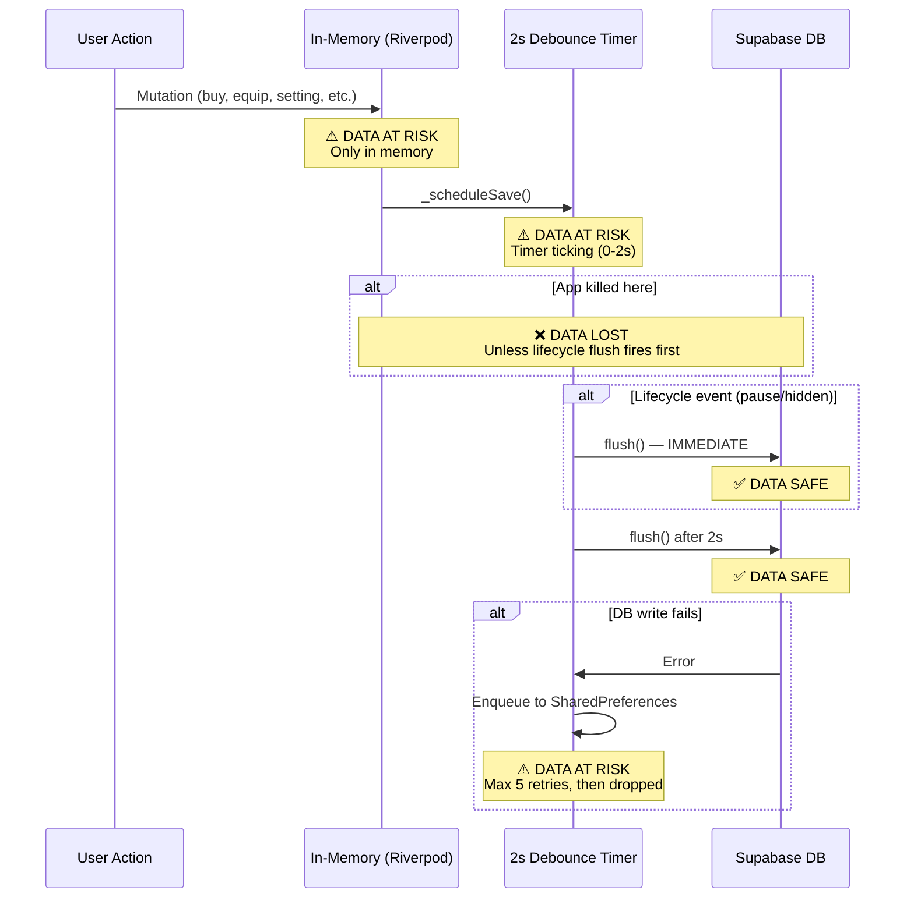

### Active Persistence Bugs (2026-02-24 Audit)

The following bugs were identified by tracing every database interaction through the complete game lifecycle. They explain why persistence is unreliable despite all the previous fixes.

#### BUG 1 — CRITICAL: Flush `.then()` Race Condition Silently Drops Writes

**File:** `user_preferences_service.dart:758-820` (inside `_flush()`)

**The problem:** When `_flush()` runs, it captures the current `_pendingProfile` (or `_pendingSettings` / `_pendingAccountState`) and starts an async Supabase upsert. The `.then()` callback unconditionally clears the dirty flag and nulls the pending data. But Dart's event loop allows other code to run during the `await` — so if a user action triggers `_syncProfile()` or `_syncAccountState()` while the network call is in-flight, the new mutation's dirty flag and pending payload are overwritten by the stale `.then()` callback.

**Reproduction scenario:**
```
1. Game completes → recordGameCompletion() → flush()
2. flush() captures _pendingProfile = {coins: 500, gamesPlayed: 10}
3. Network upsert starts (async, ~200ms RTT)
4. During await: user equips a new plane → _syncAccountState()
   → _accountStateDirty = true, _pendingAccountState = {equippedPlaneId: 'jet'}
   → _scheduleSave() starts 2s timer
5. Network upsert completes → .then() fires:
   → _accountStateDirty = false    ← OVERWRITES the true from step 4
   → _pendingAccountState = null   ← DESTROYS the payload from step 4
   → _clearLocalCache()            ← DELETES the crash-safe backup
6. 2s timer fires → _flush() → _accountStateDirty is false → SKIP
7. Equipped plane change is SILENTLY LOST
```

**Why it matters:** ANY state change that occurs during a flush is vulnerable. This includes:
- Equipping items while score is being saved
- Settings changes while lifecycle flush is running
- Daily streak updates if the abort path (see BUG 2) triggers a debounced write that overlaps with the lifecycle flush

**Fix:** Use write-version counters per table. In `.then()`, only clear the dirty flag and pending data if no new mutation has occurred since the flush started:
```dart
int _profileWriteVersion = 0;

void saveProfile(Player player) {
  _profileWriteVersion++;
  _profileDirty = true;
  _pendingProfile = { ... };
  _cacheLocally(_kLocalProfile, _pendingProfile!);
  _scheduleSave();
}

// In _flush():
if (_profileDirty && _pendingProfile != null) {
  final payload = _pendingProfile!;
  final versionAtFlush = _profileWriteVersion;
  futures.add(
    client.from('profiles').upsert(payload).then((_) {
      // Only clear if no new writes happened during the network call.
      if (_profileWriteVersion == versionAtFlush) {
        _profileDirty = false;
        _pendingProfile = null;
        _clearLocalCache(_kLocalProfile);
      }
      LeaderboardService.instance.invalidateCache();
    }).catchError((Object e) async {
      await _queue.enqueue('profiles', payload, 'upsert');
    }),
  );
}
```

**Severity:** CRITICAL — silent data loss with no error, no warning, no crash-safe recovery.

---

#### BUG 2 — HIGH: Abort Path Fires Daily Callbacks AFTER Flush

**File:** `play_screen.dart:1110-1154` (the `_onAbort` / quit code path)

**The problem:** There are two code paths for game completion:

- **Normal completion** (`_completeLanding`, line 684): fires `onComplete` and `onDailyComplete` callbacks BEFORE `recordGameCompletion()` → flush(). This is correct — daily streak data is dirty before the flush and gets written.

- **Abort/quit path** (line ~1060): calls `recordGameCompletion()` with flush() FIRST (line 1111), THEN fires `onComplete` (line 1131) and `onDailyComplete` (line 1154) AFTER. The daily streak and daily result changes are marked dirty but never explicitly flushed — they rely on the 2-second debounce timer only.

**Reproduction scenario:**
```
1. Player starts daily challenge, plays 2 of 5 rounds
2. Player taps "Quit" → abort path
3. recordGameCompletion() → flush() → writes profile (stats, coins) ✓
4. onComplete fires → recordDailyChallengeCompletion() → _syncAccountState() → marks dirty
5. onDailyComplete fires → recordDailyResult() → _syncAccountState() → marks dirty
6. _scheduleSave() starts 2-second timer
7. Navigator.pop() fires → user is back on DailyChallengeScreen
8. Player closes app within 2 seconds
9. daily_streak_data and last_daily_result are LOST
10. Next session: daily challenge shows as NOT completed, streak may break
```

**Fix:** Add an explicit `flush()` call after the daily callbacks in the abort path, matching the normal completion path's ordering. Or better: reorder the abort path to fire daily callbacks BEFORE `recordGameCompletion()`, matching the normal path.

**Severity:** HIGH — daily streak loss on abort, no crash-safe recovery because the lifecycle flush may not fire on web.

---

#### BUG 3 — HIGH: No Flush Mutex Allows Concurrent Writes

**File:** `user_preferences_service.dart:616-620` (`flush()` method)

**The problem:** `flush()` can be called concurrently from multiple sources:
- `recordGameCompletion()` → `await flush()`
- `AppLifecycleState.hidden` → `flush()` (fire-and-forget, no await)
- `AppLifecycleState.paused` → `flush()` (fire-and-forget, no await)
- Web `beforeunload` → `flush()` (fire-and-forget)
- Debounce timer → `_flush()`
- `refreshFromServer()` → `flush()` (if pending writes detected)

If two flushes run concurrently:
1. Both read `_profileDirty = true` and `_pendingProfile = {...}`
2. Both start a Supabase upsert with the same payload
3. First to complete clears dirty flags and nulls pending data
4. Second's `.then()` also runs — harmlessly clears already-null data, BUT:
5. If a NEW mutation happened between the two flushes' reads, the first flush's `.then()` has already cleared the dirty flag before the second flush saw it

Combined with BUG 1, concurrent flushes amplify the race window.

**Fix:** Add a Completer-based mutex to `_flush()`:
```dart
Completer<void>? _flushLock;

Future<void> _flush() async {
  if (_flushLock != null) {
    // Another flush is in-flight. Wait for it, then check if we still need to flush.
    await _flushLock!.future;
    if (!_profileDirty && !_settingsDirty && !_accountStateDirty) return;
  }
  _flushLock = Completer<void>();
  try {
    // ... existing flush logic with version counters from BUG 1 fix ...
  } finally {
    _flushLock!.complete();
    _flushLock = null;
  }
}
```

**Severity:** HIGH — amplifies BUG 1 race window; duplicate Supabase writes waste bandwidth.

---

#### BUG 4 — MEDIUM: Crash-Safe Cache Can Regress Stats (Stale Overwrite)

**File:** `user_preferences_service.dart:706-736` (`_recoverLocalCache()`)

**The problem:** The crash-safe local cache is written immediately by `_cacheLocally()` on every `save*()` call, before the network flush. When loaded, `_recoverLocalCache()` merges using `{...serverData, ...localData}` — local data unconditionally overwrites server data. There is no timestamp or version comparison.

**Reproduction scenario (multi-session):**
```
1. Session A: Player has coins=500 (server + local cache both have 500)
2. Flush succeeds → local cache cleared ✓
3. Player earns 100 coins → _cacheLocally writes coins=600 to SharedPreferences
4. Flush succeeds → local cache cleared ✓ (coins=600 on server)
5. Player earns 50 more coins → _cacheLocally writes coins=650 to SharedPreferences
6. Flush FAILS (network error) → local cache persists with coins=650
7. App crashes or user closes before retry
8. Next session: server has coins=600 (last successful write)
9. _recoverLocalCache: {server: coins=600, local: coins=650} → merged: coins=650 ✓
   (This case is CORRECT — local is newer)
```

**But this scenario causes regression:**
```
1. Device A: Player has coins=600 (server + local)
2. _cacheLocally writes coins=600 to Device A local storage
3. Flush succeeds on Device A → local cache cleared ✓
4. Player switches to Device B, plays, earns coins → server now has coins=800
5. Player returns to Device A (stale local cache was cleared in step 3, so no issue)
   → Actually fine in this case.
```

**The real regression risk is within a single session:**
```
1. _cacheLocally writes profile with coins=500
2. Flush starts → captures payload {coins: 500}
3. Player earns 100 coins → _cacheLocally writes coins=600
4. Flush's .then() fires → _clearLocalCache() clears the crash-safe cache!
   → The coins=600 local cache is DELETED even though it's newer than what was flushed
5. App crashes before next debounced flush
6. Next load: server has coins=500, no local cache to recover from
7. 100 coins LOST
```

This is actually a variant of BUG 1 — the `.then()` callback clearing the local cache deletes crash-safe data that was written AFTER the flush payload was captured.

**Fix:** The version-counter fix from BUG 1 also fixes this — only clear the local cache if no new writes happened during the flush.

**Severity:** MEDIUM — causes coin/stat regression, but only when flush and mutation overlap (same race window as BUG 1).

---

#### BUG 5 — LOW: ARCHITECTURE.md Flow 8 Documents Wrong Callback Order

**File:** `ARCHITECTURE.md` Flow 8 (On Completing Daily Challenge)

The Flow 8 diagram shows:
```
PlayScreen → recordGameCompletion(flush) → ResultDialog → "Done" tap → DailyScreen → recordDailyChallengeCompletion
```

But the actual code in `_completeLanding()` (lines 762-824) fires callbacks BEFORE `recordGameCompletion()`:
```
PlayScreen → onComplete(recordDailyChallengeCompletion) → onDailyComplete(recordDailyResult) → recordGameCompletion(flush)
```

The ARCHITECTURE.md should be corrected to match the code. The risk matrix entry "Daily challenge → onComplete callback: Streak + daily result saved to account_state → Debounced 2s — not immediate → Risk" is WRONG for the normal completion path (it IS flushed immediately) but CORRECT for the abort path (BUG 2).

**Fix:** Update Flow 8 to show the correct callback ordering. Add a separate flow for the abort path.

---

### Previously Identified Gaps (All Fixed)

| # | Gap | Fix Applied | Files Changed |
|---|-----|-------------|---------------|
| 1 | **iOS Safari PWA kill** — no lifecycle event fires | Added `beforeunload` web event handler via `WebFlushBridge` that triggers `UserPreferencesService.flush()` + `ErrorService.flush()` before page unload | `web_flush_bridge.dart`, `web_flush_bridge_web.dart`, `web_flush_bridge_stub.dart`, `main.dart` |
| 2 | **Challenge round result has no retry** | Added exponential backoff retry (1s, 2s, 4s) up to 3 retries on both `submitRoundResult()` and `tryCompleteChallenge()` | `challenge_service.dart` |
| 3 | **Stale challenges never expire** | Added `expire_stale_challenges()` SQL function that marks pending/in_progress challenges older than 7 days as expired; called automatically by Vercel health cron every 3 days | `20260221_expire_stale_challenges.sql`, `api/health/index.js` |
| 4 | **Daily streak timezone ambiguity** | Changed `AccountState._todayStr()` from `DateTime.now()` to `DateTime.now().toUtc()`, matching `DailyStreak` model which already uses UTC | `account_provider.dart` |
| 5 | **Avatar part purchase without Save** | Auto-save avatar config immediately after purchasing a part in the editor (calls `updateAvatar()` right after `purchaseAvatarPart()`) | `avatar_editor_screen.dart` |
| 6 | **Offline queue hard limits** | Increased queue from 50→200 entries and 3→5 retries; added `SyncStatusIndicator` widget in profile AppBar that shows pending offline write count | `user_preferences_service.dart`, `sync_status_indicator.dart`, `profile_screen.dart` |
| 7 | **No server-side coin validation** | Added `purchase_cosmetic()` SQL function with row-level locking, balance check, duplicate detection, and atomic coin deduction; `purchaseCosmetic()` now fires server-side RPC validation after optimistic client-side update | `20260221_purchase_cosmetic_function.sql`, `account_provider.dart` |

---

## Flush Trigger Map

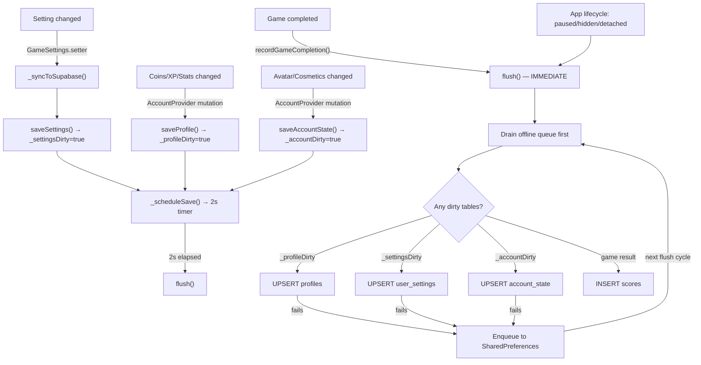

---

## Vercel Serverless Endpoints

| Endpoint | Method | Auth | Purpose |
|----------|--------|------|---------|
| `/api/errors` | POST | None (open) | Receive error reports from Flutter app |
| `/api/errors` | GET | X-API-Key header | Query stored errors (severity, since, limit) |
| `/api/health` | GET | None | Health check + Supabase keep-alive ping |

The health endpoint is hit by a Vercel cron every 3 days to prevent Supabase's free-tier auto-pause (7-day inactivity timeout).

---

## Key File Reference

| Component | File |
|-----------|------|
| App entry + lifecycle flush | `lib/main.dart` |
| Supabase config | `lib/core/config/supabase_config.dart` |
| Auth service | `lib/data/services/auth_service.dart` |
| Account provider (Riverpod) | `lib/data/providers/account_provider.dart` |
| Persistence service | `lib/data/services/user_preferences_service.dart` |
| Game settings singleton | `lib/core/services/game_settings.dart` |
| Settings UI | `lib/core/widgets/settings_sheet.dart` |
| Login screen | `lib/features/auth/login_screen.dart` |
| Profile screen | `lib/features/profile/profile_screen.dart` |
| Play screen (game) | `lib/features/play/play_screen.dart` |
| Daily challenge screen | `lib/features/daily/daily_challenge_screen.dart` |
| Shop screen | `lib/features/shop/shop_screen.dart` |
| Avatar editor | `lib/features/avatar/avatar_editor_screen.dart` |
| Leaderboard service | `lib/data/services/leaderboard_service.dart` |
| Challenge service | `lib/data/services/challenge_service.dart` |
| Matchmaking service | `lib/data/services/matchmaking_service.dart` |
| Friends service | `lib/data/services/friends_service.dart` |
| Error telemetry API | `api/errors/index.js` |
| Health check API | `api/health/index.js` |
| SQL migrations | `supabase/migrations/*.sql` |

---

## Complete Database Interaction Trace (2026-02-24 Audit)

Every Supabase read/write traced through the full game lifecycle. Use this to diagnose persistence issues.

### Write Operations — When Data is Sent to Supabase

| # | Trigger | Table | Operation | Write Strategy | Flush Guarantee | File:Line |
|---|---------|-------|-----------|----------------|-----------------|-----------|
| W1 | Game completion (normal) | `profiles` | UPSERT | Debounced → **immediate flush** | Explicit `flush()` at end of `recordGameCompletion()` | `account_provider.dart:748` |
| W2 | Game completion (normal) | `account_state` | UPSERT | Debounced → **immediate flush** | Daily callbacks fire BEFORE flush, included in same cycle | `account_provider.dart:748` |
| W3 | Game completion (normal) | `scores` | INSERT | Immediate | `saveGameResult()` awaited inline | `account_provider.dart:737` |
| W4 | Game completion (normal) | `coin_activity` | INSERT | Fire-and-forget | Best effort, queued on failure | `account_provider.dart:524` |
| W5 | **Game abort** | `profiles` | UPSERT | Debounced → **immediate flush** | Flush inside `recordGameCompletion()` | `play_screen.dart:1113` |
| W6 | **Game abort** | `account_state` | UPSERT | Debounced 2s **ONLY** | **NO explicit flush** — daily callbacks fire AFTER flush (BUG 2) | `play_screen.dart:1131-1154` |
| W7 | **Game abort** | `scores` | INSERT | Immediate | Same as W3 | `play_screen.dart:1113` |
| W8 | Setting changed | `user_settings` | UPSERT | Debounced 2s | Lifecycle flush on app pause/hide | `game_settings.dart:56-68` |
| W9 | Setting changed (local) | SharedPreferences | SET | Immediate | `_saveToLocal()` awaited | `game_settings.dart:112-131` |
| W10 | Avatar saved | `account_state` | UPSERT | Debounced → **immediate flush** | `updateAvatar()` calls `flush()` | `account_provider.dart:758` |
| W11 | Shop purchase (coins) | `profiles` | UPSERT | Debounced 2s | Lifecycle flush only | `account_provider.dart:546` |
| W12 | Shop purchase (ownership) | `account_state` | UPSERT | Debounced 2s | Lifecycle flush only | `account_provider.dart:796` |
| W13 | Shop purchase (server RPC) | `profiles` + `account_state` | RPC | Immediate fire-and-forget | Server-side atomic, but client-side already applied optimistically | `account_provider.dart:806-848` |
| W14 | Region unlock | `profiles` + `account_state` | UPSERT | Debounced 2s | Lifecycle flush only | `account_provider.dart:567-572` |
| W15 | License reroll | `account_state` | UPSERT | Debounced 2s | Lifecycle flush only | `account_provider.dart:993` |
| W16 | Free reroll | `account_state` | UPSERT | Debounced 2s | Lifecycle flush only | `account_provider.dart:1026` |
| W17 | Daily scramble reroll | `account_state` | UPSERT | Debounced 2s | Lifecycle flush only | `account_provider.dart:1130` |
| W18 | Equip plane/contrail/companion | `account_state` | UPSERT | Debounced 2s | Lifecycle flush only | `account_provider.dart:914-933` |
| W19 | Equip/clear title | `account_state` | UPSERT | Debounced 2s | Lifecycle flush only | `account_provider.dart:943-951` |
| W20 | Update nationality | `account_state` | UPSERT | Debounced 2s | Lifecycle flush only | `account_provider.dart:966` |
| W21 | Streak recovery | `account_state` | UPSERT | Debounced 2s | Lifecycle flush only | `account_provider.dart:1095` |
| W22 | Profile edit (username) | `profiles` | UPSERT | Debounced 2s | Lifecycle flush only | `account_provider.dart:447` |
| W23 | Challenge round result | `challenges` | UPDATE | Immediate with retry | 3 retries with backoff | `challenge_service.dart` |
| W24 | Challenge completion | `challenges` | UPDATE | Immediate with retry | 3 retries with backoff | `challenge_service.dart` |
| W25 | Matchmaking queue | `matchmaking_pool` | INSERT | Immediate | Awaited inline | `matchmaking_service.dart` |
| W26 | Friend request | `friendships` | INSERT | Immediate | Awaited inline | `friends_service.dart` |
| W27 | App lifecycle (pause/hidden/detached) | All dirty tables | UPSERT | **Immediate flush** | `flush()` from `didChangeAppLifecycleState` | `main.dart:257-262` |
| W28 | Web beforeunload | All dirty tables | UPSERT | **Immediate flush** | `WebFlushBridge` handler | `main.dart:78-83` |
| W29 | Periodic refresh (5min) | All dirty tables | UPSERT | Flush before refresh | Only if `hasPendingWrites` detected | `account_provider.dart:383` |
| W30 | Offline queue retry | Various | INSERT/UPSERT | Oldest-first, sequential | On every `_flush()` call | `user_preferences_service.dart:550-609` |

### Read Operations — When Data is Fetched from Supabase

| # | Trigger | Tables | Strategy | File:Line |
|---|---------|--------|----------|-----------|
| R1 | Login (existing session) | `profiles` | Single SELECT | `auth_service.dart:75` |
| R2 | Login (sign in/up) | `profiles` | SELECT or INSERT | `auth_service.dart:348-434` |
| R3 | `loadFromSupabase()` | `profiles` + `user_settings` + `account_state` | 3 parallel SELECTs | `user_preferences_service.dart:267-279` |
| R4 | Crash-safe recovery | SharedPreferences | Merge local over server | `user_preferences_service.dart:294-311` |
| R5 | Periodic refresh (5min) | `profiles` + `user_settings` + `account_state` | 3 parallel SELECTs | `account_provider.dart:393` |
| R6 | Leaderboard (global) | `leaderboard_global` view | Cached 30s TTL | `leaderboard_service.dart` |
| R7 | Leaderboard (daily) | `leaderboard_daily` view | Cached 30s TTL | `leaderboard_service.dart` |
| R8 | Leaderboard (friends) | `friendships` + `leaderboard_global` | Cached 30s TTL | `leaderboard_service.dart` |
| R9 | Game history | `scores` | On-demand, cached 30s | `leaderboard_service.dart` |
| R10 | Challenge list | `challenges` | On-demand | `challenge_service.dart` |
| R11 | Friends list | `friendships` | On-demand | `friends_service.dart` |
| R12 | Data export | All user tables | Parallel fetch (one-time) | `account_management_service.dart` |

### Crash-Safe Local Cache Operations (SharedPreferences)

| Key | Written By | Read By | Cleared By | Purpose |
|-----|-----------|---------|------------|---------|
| `crash_safe_profile` | `saveProfile()` via `_cacheLocally()` | `load()` via `_recoverLocalCache()` | `_flush().then()` on success, `clear()` on sign-out | Profile data surviving force-close |
| `crash_safe_settings` | `saveSettings()` via `_cacheLocally()` | `load()` via `_recoverLocalCache()` | `_flush().then()` on success, `clear()` on sign-out | Settings data surviving force-close |
| `crash_safe_account_state` | `saveAccountState()` via `_cacheLocally()` | `load()` via `_recoverLocalCache()` | `_flush().then()` on success, `clear()` on sign-out | Account state surviving force-close |
| `pending_writes` | `_PendingWriteQueue.enqueue()` on flush failure | `retryPendingWrites()` on next flush | `dequeue()` on success, `clear()` on sign-out | Offline write queue (max 200, 5 retries) |
| `game_settings` | `GameSettings._saveToLocal()` on every change | `GameSettings.loadFromLocal()` on app start | Never (overwritten on each change) | Settings cache for instant hydration |

### Data Protection Mechanisms

| Mechanism | What It Protects | Where Implemented | Limitation |
|-----------|-----------------|-------------------|------------|
| `_supabaseLoaded` guard | Prevents default `PilotLicense.random()` from being persisted before real data loads | `account_provider.dart:195,453,462` | Fragile — single boolean, no per-table granularity |
| Monotonic stat merge | Prevents stale server data from resetting incremental counters | `account_provider.dart:252-301` | Does NOT protect coins (consumable), avatar, license, cosmetics, daily streak |
| `_hydrating` guard | Prevents `GameSettings.hydrateFrom()` from triggering a write-back to Supabase | `game_settings.dart:52,55,74,92,105` | Only protects settings; no equivalent for profile or account_state hydration |
| Debounce batching | Coalesces rapid mutations into single write | `user_preferences_service.dart:738-741` | 2-second window where data exists only in memory |
| Offline write queue | Retries failed Supabase writes | `user_preferences_service.dart:29-171` | Capped at 200 entries, 5 retries; dropped after max retries |
| Crash-safe local cache | Recovers mutations from force-close | `user_preferences_service.dart:666-736` | Subject to BUG 4 (stale overwrite); cleared by successful flush even if newer data exists |
| Lifecycle flush | Writes dirty data when app backgrounds | `main.dart:248-263` | Unreliable on iOS Safari PWA; `hidden` may not fire on tab close |
| Web beforeunload flush | Last-chance write on web page unload | `main.dart:78-83` via `WebFlushBridge` | `beforeunload` not fired on iOS PWA swipe-away |

---

## Fix Plan — Persistence Reliability (Priority Order)

### Fix 1: Version-Guarded Flush (Fixes BUG 1 + BUG 4)

**File:** `lib/data/services/user_preferences_service.dart`

**Changes:**
1. Add `int _profileWriteVersion = 0`, `_settingsWriteVersion`, `_accountStateWriteVersion`
2. Increment the version counter in each `save*()` method
3. In `_flush()`, capture the version at flush start
4. In `.then()` callbacks, only clear dirty flag + pending data + local cache if the version hasn't changed
5. If version HAS changed, leave dirty flag set and don't clear the local cache — the next flush cycle will pick it up

**Impact:** Eliminates silent data loss from overlapping mutations and flushes. The crash-safe local cache is only cleared when we KNOW no newer data was written during the flush.

### Fix 2: Flush Mutex (Fixes BUG 3)

**File:** `lib/data/services/user_preferences_service.dart`

**Changes:**
1. Add `Completer<void>? _flushLock` field
2. At the start of `_flush()`, if `_flushLock` is non-null, await it, then re-check dirty flags
3. Create a new `Completer` at flush start, complete it in a `finally` block
4. This serializes concurrent flush calls while allowing new mutations to accumulate during the wait

**Impact:** Prevents duplicate Supabase writes and eliminates the race amplification from concurrent flushes.

### Fix 3: Abort Path Callback Ordering (Fixes BUG 2)

**File:** `lib/features/play/play_screen.dart`

**Changes:**
1. In the abort/quit code path (around line 1060-1170), move the daily callback block (lines 1129-1155) to BEFORE the `recordGameCompletion()` call (line 1111)
2. This matches the ordering in the normal `_completeLanding()` path (lines 768-793 before 809)
3. The daily streak and daily result will then be dirty before the flush, and included in the same flush cycle

**Alternative:** Add an explicit `await _prefs.flush()` after the daily callbacks in the abort path. But reordering is cleaner and consistent with the normal path.

**Impact:** Daily streak data is reliably persisted even when the player aborts a game.

### Fix 4: Update ARCHITECTURE.md Flow 8 (Fixes BUG 5)

**File:** `ARCHITECTURE.md`

**Changes:**
1. Correct Flow 8 diagram to show callbacks firing BEFORE `recordGameCompletion()`
2. Add a new Flow 8b for the abort path showing the (fixed) ordering
3. Update the risk matrix entry for daily challenge streak

### Fix 5 (Optional): Diagnostic Logging for Persistence Debugging

**File:** `lib/data/services/user_preferences_service.dart`

**Changes:**
1. Add `debugPrint` statements at key points:
   - When a dirty flag is set (which table, write version)
   - When `_flush()` starts (which tables are dirty, versions)
   - When `.then()` fires (version comparison result: cleared vs skipped)
   - When crash-safe cache is written, recovered, or cleared
2. Gate all logging behind `kDebugMode` to ensure zero release overhead

**Impact:** Future persistence bugs can be diagnosed from console output without code archaeology.
